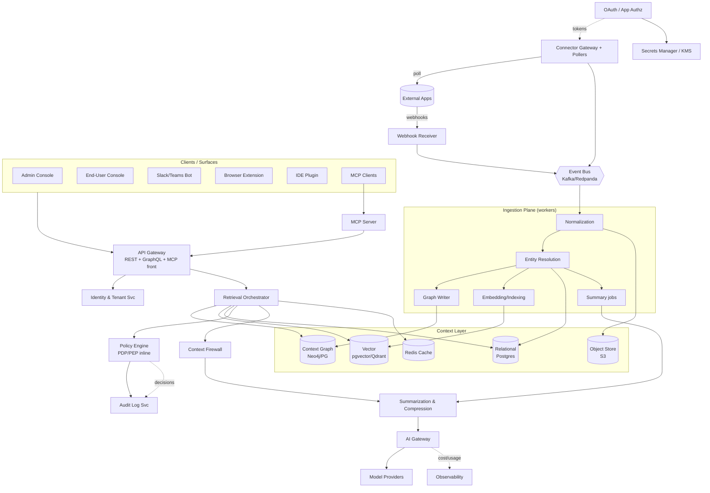
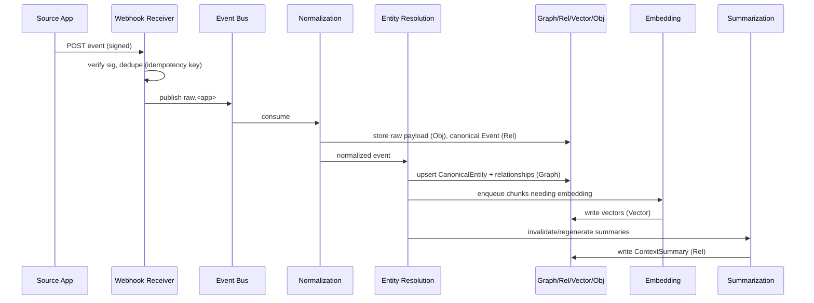
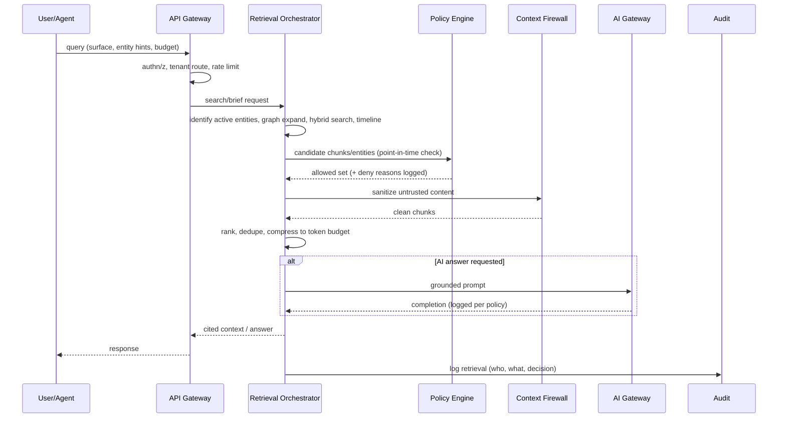
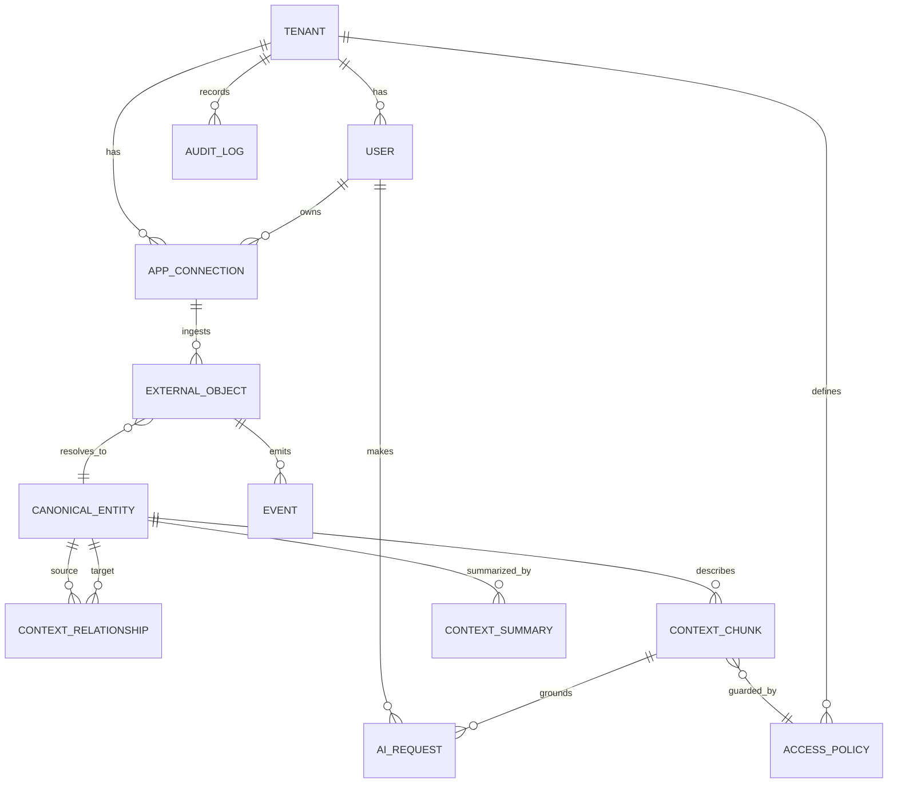
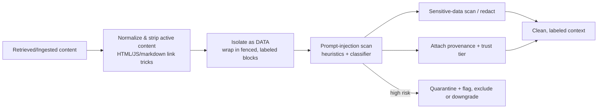

# Context Fabric — Architecture Specification (Draft v0.1)

**The secure context layer for enterprise AI.**

*An enterprise context orchestration platform that connects apps, permissions, events, knowledge, and AI assistants into one governed context fabric.*

| | |
|---|---|
| **Status** | Draft v0.1 — first engineering draft, not yet reviewed |
| **Audience** | Founding engineering team, security architecture, platform leadership |
| **Author role** | Principal architect / staff platform eng / security architect / enterprise AI product |
| **Document type** | Implementation-ready architecture specification |

> **How to read this document.** Sections 1–5 frame the problem and integration constraints. Sections 6–14 are the buildable core (architecture, services, data, APIs, retrieval, security, connectors, MCP). Sections 15–23 cover UX, workflows, MVP/roadmap, stack, cost, observability, failure modes, and next steps. Assumptions are labelled **[ASSUMPTION]**. Platform limitations are labelled **[LIMITATION]**.

---

## Table of Contents

1. [Executive Summary](#1-executive-summary)
2. [Product Definition](#2-product-definition)
3. [Core Problem & Vision](#3-core-problem--vision)
4. [ChatGPT / AI Surface Integration Modes](#4-chatgpt--ai-surface-integration-modes)
5. [Core Use Cases](#5-core-use-cases)
6. [Architecture Overview](#6-architecture-overview)
7. [Service Design](#7-service-design)
8. [Data Model](#8-data-model)
9. [API Design](#9-api-design)
10. [Retrieval & Context Ranking](#10-retrieval--context-ranking)
11. [Security & Governance](#11-security--governance)
12. [AI Safety & Data Controls](#12-ai-safety--data-controls)
13. [Connector Framework](#13-connector-framework)
14. [MCP Server Design](#14-mcp-server-design)
15. [User Experience](#15-user-experience)
16. [Example Workflows](#16-example-workflows)
17. [MVP Scope & Phased Roadmap](#17-mvp-scope--phased-roadmap)
18. [Technology Stack](#18-technology-stack)
19. [Cost Optimization](#19-cost-optimization)
20. [Observability](#20-observability)
21. [Failure Modes](#21-failure-modes)
22. [Open Questions](#22-open-questions)
23. [Recommended Next Engineering Tasks](#23-recommended-next-engineering-tasks)

---

## 1. Executive Summary

Context Fabric is enterprise middleware that builds a **secure, governed, persistent context layer** across the business applications an organization already runs (Salesforce, Slack/Teams, Jira, Confluence, SharePoint, Google Drive, Notion, GitHub, ServiceNow, email/calendar, BI tools, internal APIs). It ingests events and records from those systems, normalizes them into a shared entity and relationship graph, and exposes **permission-aware, auditable** context to AI assistants and agents at the moment of need — without users copy/pasting between tools.

The hard problem is not "connect apps." Dozens of iPaaS products connect apps. The hard problems are:

1. **Permission fidelity** — surfacing context to an AI must respect the *source system's* access rules, at the *moment of retrieval*, not at the moment of ingestion. A user must never see, via the AI, something they could not see by logging into the source app.
2. **Context selection under a token/cost budget** — naively dumping records into a model is expensive and degrades answer quality. Ranking, compression, summarization, and caching are first-class.
3. **Trust & governance** — auditability, tenant isolation, retention/legal hold, redaction, and defense against prompt injection delivered *through* the very content being retrieved.

The architecture is an **event-driven ingestion pipeline** feeding a **multi-store context layer** (relational + vector + graph + object), fronted by a **Retrieval Orchestrator** and a **Policy Engine** that sits inline on every read. Delivery is through multiple surfaces — REST/GraphQL APIs, an **MCP server** for agentic clients, Slack/Teams bots, a browser extension, and IDE plugins — all of which call the same governed core. AI model calls are mediated by an **AI Gateway** with provider abstraction, budgeting, redaction, and logging policy.

A realistic MVP (Phase 1) ships multi-tenant auth (OIDC), four connectors (Slack, Salesforce, Jira, GitHub), webhook ingestion, the canonical entity model, a basic context graph, Postgres + pgvector + S3, Policy Engine v1, audit logs, context search + brief APIs, a Slack bot, and an MCP server v1. Enterprise hardening (SSO/SCIM/SIEM/DLP), advanced entity resolution, graph ranking, cost optimization, and a connector marketplace follow in Phases 2–4.

---

## 2. Product Definition

**What it is:** A middleware platform — not an end-user app and not a model. It owns the *plumbing and governance* between source systems and AI surfaces.

**What it is not:**

- It is **not** a replacement for the source systems' own permission models — it *honors* them.
- It is **not** a single AI assistant — it is the context substrate that *any* approved assistant can draw from.
- It does **not** train models on customer data; it is a retrieval/grounding layer (see §12 no-training stance).
- It is **not** a general data lake / warehouse; it stores a *curated, governed working set* of context optimized for retrieval, with raw payloads retained per policy.

**Primary buyers:** CIO / CISO / VP Platform / Head of Enterprise AI. **Primary users:** knowledge workers (sales, support, engineering, execs) and AI agents acting on their behalf.

**Core value propositions:**

| Stakeholder | Value |
|---|---|
| End user | Stop re-explaining context to AI; get grounded, cited answers across tools |
| Engineering | One governed context API + MCP server instead of N bespoke integrations per assistant |
| Security/Compliance | Central enforcement point, full audit trail, retention/legal hold, redaction, SIEM export |
| Finance/Platform | Cost-aware AI usage with attribution and budgets |

**Key product principles:**

1. **Permission parity** — the AI's view ⊆ the user's view in source systems.
2. **Enforce in the core, not the UI** — every read passes the Policy Engine server-side.
3. **Grounded, cited, provenanced** — every AI answer traces to source objects with links.
4. **Cost is a feature** — retrieval is budget-bounded by design.
5. **Connectors are a contract** — a typed SDK so new apps are additive, not architectural.

---

## 3. Core Problem & Vision

### 3.1 The problem

Enterprise knowledge is fragmented across apps, each holding *partial* state: Salesforce knows the opportunity, Slack knows the conversation, Jira knows the work, GitHub knows the code, Confluence/SharePoint/Drive/Notion know the docs, email/calendar know commitments, BI knows the metrics, ServiceNow knows the incidents. AI assistants typically see only the surface they're embedded in. The result: users repeatedly re-explain context, answers are weaker than they should be, and every app's AI is an island with no shared organizational memory.

### 3.2 The vision

A modular platform that:

1. **Connects** to enterprise apps via OAuth, service accounts, webhooks, polling, APIs, event streams, and a connector SDK.
2. **Ingests** events and data asynchronously.
3. **Normalizes** into canonical entities: User, Team, Account, Client, Opportunity, Project, Ticket, Document, Repository, Pull Request, Incident, Meeting, Message, Decision, Task, Business Metric.
4. **Builds a context graph** linking people, apps, objects, conversations, documents, and decisions.
5. **Stores** raw events, normalized entities, embeddings, layered summaries, relationships, and access policies.
6. **Retrieves** the most relevant context for a user's current task under a cost budget.
7. **Enforces** permissions and governance before exposing anything.
8. **Delivers** approved context into AI workflows through APIs, an MCP server, browser extension, Slack/Teams bots, IDE plugins, and app-specific integrations.
9. **Administers** via a dashboard for connections, policies, logs, usage, cost, governance.
10. **Empowers users** with a console for linking, visibility, consent, and sharing preferences.

---

## 4. ChatGPT / AI Surface Integration Modes

A hard design constraint: **Context Fabric cannot log into a user's personal ChatGPT account and inject context everywhere.** Consumer ChatGPT exposes no sanctioned API for a third party to push context into a user's chat session. We design for sanctioned integration paths and are explicit about limits.

| Mode | What it is | Feasibility | Requires |
|---|---|---|---|
| **A. Enterprise connector / approved actions** | Expose Context Fabric as an approved connector/action callable by ChatGPT Enterprise, Copilot, Gemini Enterprise, etc. | **Possible where the platform supports admin-installed connectors** | Official platform support + admin install. Surface-by-surface; capabilities vary. **[LIMITATION]** feature parity differs per vendor and changes over time. |
| **B. OpenAI/Anthropic API-backed assistant** | Context Fabric powers *its own* assistant UX using the org's approved model API keys, with enterprise controls and budgets. | **Fully possible — most control** | Org-approved API access (OpenAI/Anthropic/Azure OpenAI/Bedrock/Vertex). We own prompt assembly, redaction, budgeting. |
| **C. Browser extension / companion overlay** | Sidebar that shows relevant context next to the user's current web app; optional "copy to assistant" / paste-assist. | **Possible**; cannot silently inject into arbitrary third-party chat DOMs reliably or compliantly. | Enterprise-managed extension deployment (MDM). **[LIMITATION]** DOM injection into others' apps is brittle and may violate ToS; we default to *show + user-initiated copy*, not covert injection. |
| **D. Slack/Teams bot** | First-class assistant inside Slack/Teams via official bot APIs. | **Fully possible** | Slack app / Teams app manifests, bot tokens, admin install. |
| **E. IDE integration** | Context panel + commands in VS Code/Cursor; complements (not replaces) Copilot. | **Possible** | Published extension; uses MCP/REST. **[LIMITATION]** we cannot rewrite Copilot's own context window; we provide adjacent context + MCP tools. |
| **F. MCP-compatible server** | Expose tools/resources over MCP so any MCP-capable agent/IDE/assistant can query context and take approved actions. | **Fully possible — strategic default** | MCP client on the consuming side (Claude Desktop/Code, Cursor, custom agents, and increasingly other vendors). |

**Recommendation.** Lead with **Mode F (MCP)** + **Mode B (API-backed assistant)** + **Mode D (Slack/Teams)** because they are fully under our control and require no special blessing from a consumer AI vendor. Treat **Mode A** as opportunistic per-vendor integration. Treat **Mode C** as a *display/assist* surface, explicitly **not** covert injection.

---

## 5. Core Use Cases

### UC1 — Salesforce + Slack (sales state)
A manager updates an opportunity in Salesforce. Context Fabric ingests it, links it to the account, opportunity, sales team, recent Slack threads, meeting notes, and open tasks. Later in Slack a user asks *"current state of the Acme opportunity and what changed since last week."* Fabric retrieves the SF update, recent Slack messages, notes, tasks; applies permissions; summarizes; answers with citations.

### UC2 — Jira + GitHub + Slack (dev brief)
A dev is assigned a Jira story. Fabric links it to repos, branches, PRs, historical bugs, docs, Slack threads. In the IDE/chat the dev asks *"what do I need to know before implementing this?"* and gets a scoped brief: ticket, code links, prior PRs, architecture notes, acceptance criteria, risks.

### UC3 — Support escalation (ServiceNow)
An incident is escalated. Fabric links it to customer records, product docs, prior incidents, account-owner notes, Slack war-room, recent deploys. The assistant produces: incident summary, customer impact, similar incidents, suggested next actions, stakeholder update draft.

### UC4 — Meeting prep
Before a customer meeting, Fabric gathers CRM account summary, recent emails, prior meeting notes, open tickets, active opportunities, pending tasks, project status, recent escalations → generates a pre-meeting brief.

### UC5 — Executive briefing
An exec asks *"what's happening with Project Phoenix?"* Fabric pulls Jira epics, Confluence docs, Slack decisions, risk logs, budget data, timeline changes, blockers, status reports → concise summary with citations and confidence levels.

### UC6 — AI cost/credit optimization (cross-cutting)
Because AI is priced by tokens/credits, retrieval is cost-aware: rank, compress, summarize, cache, and reuse context rather than dumping raw data. This is a first-class system capability (see §19), not a use case bolted on.

---

## 6. Architecture Overview

### 6.1 System overview (engineering terms)

Context Fabric is an **event-driven ingestion pipeline** feeding a **multi-store context layer**, with all reads mediated by a **Policy Engine** and a **Retrieval Orchestrator**, and all model calls mediated by an **AI Gateway**. It is **multi-tenant** with hard tenant isolation enforced at every layer.

**Three planes:**

- **Ingestion plane (write path):** Connectors → Webhook Receiver / Pollers → Event Bus → Normalization → Entity Resolution → Context Graph + Context Store + Embedding/Indexing + Summarization. Asynchronous, idempotent, replayable.
- **Retrieval plane (read path):** Surface (Slack/IDE/MCP/API) → API Gateway → Retrieval Orchestrator → (Context Graph + Vector + Keyword + Timeline) → **Policy Engine (inline)** → Context Firewall (sanitize) → Summarization/Compression → response with citations → Audit. Synchronous, low-latency, budget-bounded.
- **AI plane:** Retrieval Orchestrator assembles a grounded prompt → AI Gateway (provider abstraction, budgeting, redaction, logging) → model → response logged per policy.

**Where things happen:**

| Concern | Where |
|---|---|
| **AI model calls** | Only through the **AI Gateway**. No service calls a provider directly. Summarization workers and the assistant surface both route through it. |
| **Permission enforcement** | **Inline in the read path**, in the Policy Engine, *server-side*, on every chunk/entity before it leaves the core. Also at index time (permission-aware partitioning) and re-checked at retrieval (point-in-time). Never in the UI alone. |
| **Context storage** | Relational (Postgres) for entities/metadata/policies/audit; Vector (pgvector→Qdrant) for embeddings; Graph (Postgres adjacency → Neo4j) for relationships; Object store (S3) for raw payloads & large blobs; Redis for cache. |
| **User/admin interaction** | Next.js dashboards (admin + end-user consoles) calling REST/GraphQL through the API Gateway. |
| **Apps → system** | Webhooks (push) validated by signature, plus pollers for systems without webhooks; both publish to the Event Bus. |
| **AI tools → system** | MCP server + REST/GraphQL; both call the Retrieval Orchestrator + Policy Engine. |

**Data flow (write path), concise:**
`source app event → Webhook Receiver (verify sig, dedupe) → Event Bus topic raw.<app> → Normalization (canonical Event) → Entity Resolution (link to CanonicalEntity) → fan-out: Context Graph update, ContextChunk creation, Embedding job, Summary invalidation/regeneration → stores updated → metrics emitted.`

**Data flow (read path), concise:**
`surface query → API Gateway (authn/z, tenant route, rate limit) → Retrieval Orchestrator (identify active entities → graph expand → hybrid search → timeline) → Policy Engine filter (point-in-time) → Context Firewall (sanitize untrusted content) → rank + dedupe + compress to budget → assemble cited context → [optional] AI Gateway → response → Audit Log.`

### 6.2 Text-based architecture diagram

```
                                   ┌─────────────────────────────────────────────┐
                                   │                CLIENTS / SURFACES             │
                                   │  Admin Console   End-User Console            │
                                   │  Slack/Teams Bot  Browser Ext  IDE Plugin    │
                                   │  MCP Clients (Claude/Cursor/agents)  3P APIs  │
                                   └───────────────┬───────────────────────────────┘
                                                   │ HTTPS / WSS / MCP
                                   ┌───────────────▼───────────────┐
                                   │          API GATEWAY           │  authn/z, tenant routing,
                                   │  (REST + GraphQL + MCP front)  │  rate limit, req validation
                                   └───┬───────────────────────┬────┘
                  ┌────────────────────┘                       └───────────────────┐
        ┌─────────▼─────────┐                                         ┌────────────▼───────────┐
        │ Identity & Tenant │  SSO/SAML/OIDC, SCIM, RBAC/ABAC subj.   │  Retrieval Orchestrator │
        └─────────┬─────────┘                                         └───┬──────────┬──────────┘
                  │                                                       │          │
        ┌─────────▼─────────┐    ┌──────────────────┐         ┌──────────▼──┐  ┌────▼─────────────┐
        │  Policy Engine    │◄───┤  Audit Log Svc   │◄────────┤Context Fire- │  │ Summarization &  │
        │ (inline, PDP/PEP) │    │ (append-only)    │         │ wall (sanit.)│  │ Compression Svc  │
        └─────────┬─────────┘    └──────────────────┘         └──────┬───────┘  └────┬─────────────┘
                  │                                                   │               │ (calls)
   ┌──────────────┼───────────────────────────────────────────┐     │          ┌────▼─────────────┐
   │              │           CONTEXT LAYER (STORES)           │     │          │   AI GATEWAY      │
   │  ┌───────────▼───┐ ┌───────────┐ ┌────────────┐ ┌───────┐ │     │          │ provider abstr.,  │
   │  │ Context Graph │ │ Relational│ │ Vector     │ │Object │ │◄────┘          │ budget, redact,   │
   │  │ (Neo4j/PG)    │ │ (Postgres)│ │ (pgvec/Qdr)│ │(S3)   │ │                │ route, log policy │
   │  └───────▲───────┘ └─────▲─────┘ └─────▲──────┘ └───▲───┘ │                └────┬──────────────┘
   │          │               │             │            │     │                     │
   └──────────┼───────────────┼─────────────┼────────────┼─────┘            ┌────────▼─────────┐
              │               │             │            │                  │ Model Providers   │
   ┌──────────┴───────────────┴─────────────┴────────────┴───────┐         │ OpenAI/Anthropic/ │
   │                    INGESTION PLANE (workers)                  │        │ Azure/Bedrock/... │
   │  Normalization → Entity Resolution → Embedding/Indexing →     │        └───────────────────┘
   │  Summarization jobs → Graph writer                            │
   └───────────────────────────▲─────────────────────────────────┘
                                │ consume
                       ┌────────┴─────────┐
                       │     EVENT BUS     │  (Kafka/Redpanda) topics: raw.*, norm.*, dlq.*
                       └────────▲─────────┘
                                │ publish
   ┌────────────────────────────┴───────────────────────────────────────────────┐
   │  Webhook Receiver (sig verify, dedupe)   │   Connector Gateway + Pollers      │
   │  ▲ push from apps                         │   ▲ pull for non-webhook apps     │
   └──┼────────────────────────────────────────┼───────────────────────────────────┘
      │                                         │
   ┌──┴──────────────┐                  ┌───────┴───────────┐     ┌─────────────────┐
   │ OAuth / App     │                  │ External Apps:    │     │ Secrets Manager  │
   │ Authorization   │  tokens (enc) ─► │ SFDC, Slack, Jira,│     │ (Vault/KMS/HSM)  │
   │ Service         │                  │ GitHub, GDrive,   │     └─────────────────┘
   └─────────────────┘                  │ SharePoint, SNOW, │
                                        │ Notion, email/cal │     ┌─────────────────┐
                                        └───────────────────┘     │ Observability   │
                                                                  │ OTel/Prom/Graf   │
                                                                  └─────────────────┘
```

### 6.3 Mermaid architecture diagram



### 6.4 Data flow diagrams

**DFD-1 — Ingestion (write path):**



**DFD-2 — Retrieval (read path):**



---

## 7. Service Design

Each service below follows: **Purpose · Responsibilities · Inputs · Outputs · Data deps · Failure modes · Scaling · Security.** Services are independently deployable; most are stateless and horizontally scalable, externalizing state to Postgres/Redis/object store/bus.

### 7.1 API Gateway
- **Purpose:** Single ingress for all external API/MCP/UI traffic.
- **Responsibilities:** TLS termination, authN (validate OIDC/JWT, API keys, bot tokens), coarse authZ, **tenant resolution & routing**, per-tenant/per-user rate limiting & quotas, request validation (schema), request IDs, WAF hooks, response shaping.
- **Inputs:** HTTP/WSS requests, MCP frames.
- **Outputs:** Routed, authenticated requests to internal services; structured errors.
- **Data deps:** Identity & Tenant Svc (token validation, tenant map), Redis (rate-limit counters).
- **Failure modes:** IdP outage (cache JWKS, short-circuit with cached validation); rate-limit store down (fail-open with conservative static limits or fail-closed per config); request flooding (shed load, 429).
- **Scaling:** Stateless; HPA on RPS/CPU; regional. Keep p99 < 20ms overhead.
- **Security:** No business logic; never trusts client-supplied tenant_id — derives from token. mTLS to internal mesh. Strict input size limits.

### 7.2 Identity & Tenant Service
- **Purpose:** Source of truth for orgs, tenants, users, groups, roles, IdP mappings.
- **Responsibilities:** OIDC/SAML federation, SCIM provisioning/deprovisioning, JWKS, role/group resolution, tenant lifecycle & settings, session/issuer config, **subject attribute resolution for ABAC**.
- **Inputs:** IdP assertions, SCIM events, admin changes.
- **Outputs:** Validated identities, subject attribute sets, tenant config.
- **Data deps:** Postgres (tenants, users, roles, groups, idp_mappings), Secrets Manager (signing keys).
- **Failure modes:** SCIM drift (reconcile job + drift detection §11); stale group mapping (TTL + webhook refresh); IdP metadata rotation.
- **Scaling:** Read-heavy; cache subject attributes in Redis with short TTL + invalidation on SCIM change.
- **Security:** Crown-jewel service. Strict audit on role/group changes. Deprovision must propagate to token revocation (§7.3) and cache invalidation within SLA (target < 5 min).

### 7.3 OAuth / App Authorization Service
- **Purpose:** Manage app authorization flows and credentials lifecycle.
- **Responsibilities:** OAuth 2.0/OIDC authz-code + PKCE flows, service-account/JWT-bearer flows, **encrypted token storage (envelope encryption via KMS)**, automatic refresh, revocation, scope management, per-connection credential isolation.
- **Inputs:** OAuth callbacks, refresh timers, revocation requests.
- **Outputs:** Token references (never raw tokens) to Connector Gateway; connection status.
- **Data deps:** Postgres (app_connections w/ token_reference), Secrets Manager/KMS (DEKs), Redis (refresh locks).
- **Failure modes:** Refresh token expired/revoked (mark connection `degraded`, alert user, pause syncs); provider clock skew; concurrent refresh (distributed lock to avoid token invalidation).
- **Scaling:** Modest; refresh is a scheduled fan-out; shard by tenant.
- **Security:** Tokens encrypted at rest with per-tenant DEKs wrapped by KMS CMK; tokens decrypted just-in-time in memory, never logged; rotation; least-scope requests.

### 7.4 Connector Gateway
- **Purpose:** Standardized runtime for all connectors (the SDK host).
- **Responsibilities:** Load connector definitions; execute polling/backfill; call source APIs with stored creds; apply per-app rate-limit & backoff; map source objects→canonical via connector mappers; **emit source permission metadata** for permission-aware indexing; publish normalized-ish events to bus.
- **Inputs:** Connector configs, schedules, token references, app API responses, webhook-triggered fetches.
- **Outputs:** `raw.<app>` / `ingest.<app>` events to bus; sync state.
- **Data deps:** OAuth Svc (creds), Postgres (sync cursors/state), bus, Redis (rate-limit tokens).
- **Failure modes:** Source API rate limits (token-bucket + adaptive backoff + jitter); partial sync failure (checkpointed cursors, resume); schema drift in source (mapper versioning, DLQ); pagination cursor expiry.
- **Scaling:** Per-connector worker pools; isolate noisy tenants/apps (bulkhead). Backfill jobs separate from live sync.
- **Security:** Connector sandboxing (resource/network limits); egress allowlist per app; output validation before publish (defense vs. injection at source — §12).

### 7.5 Webhook Receiver
- **Purpose:** Ingest push events from apps.
- **Responsibilities:** **Signature/HMAC verification per app**, replay protection (timestamp window + nonce), dedupe via idempotency keys, fast 2xx ack, publish to bus, challenge/handshake responses (e.g., Slack URL verification, SFDC).
- **Inputs:** HTTP webhooks.
- **Outputs:** `raw.<app>` events.
- **Data deps:** Secrets (signing secrets), Redis (nonce/dedupe set w/ TTL), bus.
- **Failure modes:** Replay attacks (reject stale timestamps, seen-nonce cache); duplicate delivery (idempotency); burst (buffer to bus, never block source; if bus down, persist to durable spool then replay); spoofed payloads (strict sig verify, reject unsigned).
- **Scaling:** Stateless, very high RPS; must ack within source timeout (often 3–5s). Decouple all heavy work to bus.
- **Security:** Treat all payloads as untrusted; never execute; validate sizes; per-tenant endpoint secrets.

### 7.6 Event Bus
- **Purpose:** Asynchronous backbone for ingestion/processing.
- **Recommended default:** **Kafka (or Redpanda for ops simplicity / Kafka API compatibility).**
- **Justification:** Need (1) durable, replayable, ordered-per-key logs (event replay for reindexing, ordering per entity via partition key = `tenant_id:entity_id`), (2) high throughput fan-out to multiple independent consumer groups (normalization, audit, analytics), (3) consumer-group backpressure, (4) compacted topics for latest-state, (5) tiered storage for cheap retention. EventBridge/Pub/Sub/SQS+SNS are viable on cloud-managed stacks but offer weaker replay/ordering/compaction semantics; SQS lacks native fan-out replay. **[ASSUMPTION]** self-managed or BYO-cloud deployment; if strictly serverless-AWS, substitute MSK or Kinesis. Redpanda chosen if team wants Kafka semantics without ZK/JVM ops.
- **Topics:** `raw.<app>`, `norm.events`, `entity.changes`, `embed.jobs`, `summary.jobs`, `audit.events`, `dlq.<stage>`. Partition key `tenant_id:canonical_entity_id` for per-entity ordering.
- **Failure modes:** Consumer lag (autoscale consumers, alert on lag); poison messages (retry w/ backoff → DLQ); out-of-order across partitions (handle via event `occurred_at` + version, see §21); broker loss (replication factor ≥3).
- **Scaling:** Partition count sized for peak tenant concurrency; tiered storage for replay.
- **Security:** Per-tenant data tagging in headers; encryption in transit + at rest; ACLs per consumer group.

### 7.7 Normalization Service
- **Purpose:** Transform app-specific payloads into canonical Event/object schemas.
- **Responsibilities:** Parse raw payloads, apply connector object/event mappers, persist raw blob to object store + canonical `Event` row, attach `external_object` linkage, emit to entity resolution. Mapper versioning for reprocessing.
- **Inputs:** `raw.<app>` events.
- **Outputs:** `norm.events` (canonical events), object-store blobs.
- **Data deps:** Object store (raw), Postgres (events, external_objects), connector mappers.
- **Failure modes:** Unknown payload shape (DLQ + alert + mapper update); oversized payloads (stream to object store, store reference); encoding issues.
- **Scaling:** CPU-bound parse; horizontal consumers per topic/partition.
- **Security:** Strip/flag executable content; record provenance (source app, connection, signature status).

### 7.8 Entity Resolution Service
- **Purpose:** Link records across systems into canonical entities & clusters.
- **Responsibilities:** Deterministic matching (IDs, emails, domains, URLs) + probabilistic matching (name similarity, embeddings, co-occurrence), cluster management, confidence scoring, merge/split, human-in-the-loop review for low-confidence merges. Example: SFDC Account "Acme Corp" ↔ Slack `#acme-project` ↔ Jira `ACME` ↔ Drive "Acme Client Docs" → one `account` cluster.
- **Inputs:** `norm.events`, existing entities/relationships.
- **Outputs:** Upserted `CanonicalEntity`, `ContextRelationship`, `entity.changes` events.
- **Data deps:** Context Graph, Postgres (entities), Vector (name/desc embeddings for fuzzy match).
- **Failure modes:** **Bad resolution / over-merge** (confidence thresholds, reversible merges, audit trail, review queue); under-merge (periodic recluster jobs); identity churn.
- **Scaling:** Blocking/bucketing to bound pairwise comparisons; incremental resolution on change.
- **Security:** Merges can widen access — resolution must **not** bypass policy; cluster membership is metadata, access still enforced per source object.

### 7.9 Context Graph Service
- **Purpose:** Maintain the relationship graph (people↔apps↔entities↔docs↔messages↔code↔decisions).
- **Recommended store:** **Phase 1:** Postgres adjacency tables + recursive CTEs (simpler ops, transactional with entities). **Phase 3+:** **Neo4j** (or Neptune/ArangoDB) when traversal depth/ranking demands it.
- **Responsibilities:** Write/version edges, typed relationships, weighted edges (confidence + recency + interaction strength), bounded k-hop traversal for retrieval expansion, subgraph extraction.
- **Inputs:** `entity.changes`, relationship writes.
- **Outputs:** Subgraphs for retrieval, neighborhood queries.
- **Data deps:** Postgres/Neo4j.
- **Failure modes:** Supernodes (cap fan-out, weight-based pruning); cycles (visited set, depth cap); stale edges (TTL/decay).
- **Scaling:** Read replicas; cache hot subgraphs in Redis; precompute entity neighborhoods.
- **Security:** Traversal returns candidate edges only; **node visibility enforced by Policy Engine downstream**, not by the graph.

### 7.10 Context Store
- **Purpose:** Canonical persistence for entities, summaries, event history, relationships, metadata.
- **Storage choices:**
  - **Relational (Postgres):** entities, relationships (Phase 1), events, summaries, policies, audit, connections, AI requests. Strong consistency, RLS for tenant isolation.
  - **Document/JSONB (in Postgres):** flexible `attributes`, `raw_metadata`.
  - **Vector (pgvector → Qdrant/Weaviate):** chunk embeddings.
  - **Graph (PG adjacency → Neo4j):** relationships at scale.
  - **Object store (S3-compatible):** raw payloads, large docs, exports.
- **Failure modes:** Hot partitions (partition by tenant+time); large blobs (offload to object store); cross-store consistency (treat Postgres as system of record; vector/graph as derived & rebuildable from bus replay).
- **Scaling:** Postgres partitioning + read replicas; per-tenant logical isolation (RLS) with option for dedicated DB for large tenants.
- **Security:** Row-Level Security keyed on tenant_id; column encryption for sensitive fields; PITR backups.

### 7.11 Embedding & Indexing Service
- **Purpose:** Generate embeddings and maintain vector + keyword indexes.
- **Responsibilities:** **Chunking** (semantic + structural; ~256–512 token chunks w/ overlap, per content-type strategies), embed via AI Gateway, write vectors with metadata, maintain keyword index (Postgres FTS/OpenSearch), **incremental updates** on entity change, **deletion/tombstoning** on source delete/revoke, **permission-aware indexing** (store source ACL fingerprint + sensitivity label as filterable metadata).
- **Inputs:** `embed.jobs`, content chunks, permission metadata.
- **Outputs:** Vectors + keyword index entries with ACL/sensitivity metadata.
- **Data deps:** Vector store, keyword index, AI Gateway (embeddings), object store.
- **Chunking strategy:** by content type — messages grouped by thread/time window; docs by heading/section; code by symbol/file; tickets by field-group (summary/description/comments). Store `source_object_id`, offsets, and `content_hash` to enable dedupe and incremental re-embed only on content change.
- **Update strategy:** re-embed only changed chunks (hash diff); version embeddings with model id.
- **Deletion strategy:** on source delete/revoke → tombstone chunk + remove vector + invalidate summaries + purge caches (see §16 Workflow E).
- **Failure modes:** Embedding provider outage (queue + backoff, serve stale index); model version drift (record model id, background re-embed); queue depth spikes (autoscale, prioritize fresh/hot entities).
- **Scaling:** Batch embeddings; prioritize by importance/freshness; backpressure via bus.
- **Security:** **Permission-aware partitioning** — vectors carry ACL fingerprints so retrieval can pre-filter; but final authority is the Policy Engine at read time (ACL fingerprints can go stale).

### 7.12 Retrieval Orchestrator
- **Purpose:** Given user/tenant/surface/task/query/budget, return the most relevant *allowed* context.
- **Responsibilities:** Active-entity identification, graph expansion, **hybrid search (vector + keyword)**, timeline/recent-events pull, **policy filtering (delegates to Policy Engine, point-in-time)**, ranking, dedupe, compression to budget, citation assembly, retrieval logging. Orchestrates §7.13 and §7.16 when an AI answer is requested.
- **Inputs:** Retrieval request (see §10 inputs).
- **Outputs:** Ranked, cited, budget-bounded context bundle (and optional grounded answer).
- **Data deps:** Graph, Vector, Keyword, Postgres (events/summaries), Policy Engine, Context Firewall, AI Gateway, Redis (cache).
- **Failure modes:** Over-broad query (cap candidates, budget guard); store partial outage (degrade gracefully — fall back to summaries/keyword); policy service slow (fail-closed); cache staleness (TTL + invalidation on entity.changes).
- **Scaling:** Stateless; cache by (entity, query-class, role, freshness-bucket); precomputed entity briefs.
- **Security:** **Never returns content not passed by Policy Engine.** Citations point only to objects the user may open. No leakage of denied-object metadata (§16 Workflow D).

### 7.13 Summarization & Compression Service
- **Purpose:** Produce layered summaries and compress context to budget.
- **Responsibilities:** Generate/maintain a **summary hierarchy** — raw → short chunk summary → entity summary → timeline summary → decision summary → task summary → executive summary. Compress retrieved bundles (extractive pre-pass + abstractive), maintain summary freshness, attach provenance & confidence.
- **Inputs:** `summary.jobs`, chunks, entity changes; retrieval-time compression requests.
- **Outputs:** `ContextSummary` rows (cached, reusable); compressed context bundles.
- **Data deps:** AI Gateway, Postgres (summaries), object store, Redis.
- **Token/credit optimization:** precompute & cache entity/timeline summaries (amortize cost across many reads); use **small models for summaries, large models for final synthesis**; extractive filtering before abstractive; cache keyed by `(entity, source_chunk_hash_set, model)`; invalidate only affected summaries on change.
- **Failure modes:** Stale summary after source change (invalidate on `entity.changes`; show freshness/“as of”); summary hallucination (extractive grounding + citation check §12); provider outage (serve last-good summary, flag staleness).
- **Scaling:** Async precompute on write; on-demand only when missing/stale.
- **Security:** Summaries inherit the **most restrictive** sensitivity of their sources; summary access re-checked at read (a summary may mix sources with different ACLs → store per-source provenance and re-filter, or scope summaries to a single ACL band).

### 7.14 Policy Engine
- **Purpose:** Centralized authorization & governance decision point (PDP) with enforcement (PEP) inline on every read.
- **Responsibilities:** Evaluate **RBAC + ABAC**, app-to-app sharing rules, entity-level & field-level restrictions, tenant isolation, legal hold, retention, revocation, consent. Returns allow/deny + reason + obligations (e.g., redact field X). Point-in-time evaluation using current subject attributes and current source-ACL fingerprint.
- **Inputs:** Subject (user attrs/roles/groups/consent), resource (entity/chunk/field + sensitivity + source ACL), action, environment (surface, time).
- **Outputs:** Decision (allow/deny/redact), reason code, obligations; audit event.
- **Data deps:** Identity & Tenant (subject attrs), Postgres (access_policies, sensitivity labels), source ACL metadata, legal-hold/retention config.
- **Policy model:** declarative policies (`policy_type`, `subject_selector`, `resource_selector`, `action`, `conditions`, `effect`, `priority`); deny-overrides; default-deny. Implementable with OPA/Rego or Cedar engine embedded as a library + policy store. **Recommendation: Cedar or OPA** for verifiable, testable policy.
- **Failure modes:** Policy store unreachable (**fail-closed**); conflicting policies (priority + deny-overrides + lint at write); stale source ACL (re-check against source on sensitive reads / short TTL).
- **Scaling:** Decision caching keyed on (subject-attrs-hash, resource-class, policy-version) with aggressive invalidation; sidecar/library mode to avoid network hop.
- **Security:** This is *the* enforcement boundary. Must run server-side, inline, non-bypassable. All decisions audited. Permission parity invariant: **AI view ⊆ user's source view.**

### 7.15 Audit Log Service
- **Purpose:** Tamper-evident record of all sensitive events.
- **Responsibilities:** Append-only capture of: app connected/disconnected, token refreshed/revoked, context retrieved, context shared, AI request made, data exported, policy denied access, admin settings changed, entity merged, deletion executed. Hash-chaining for tamper evidence; SIEM export.
- **Inputs:** `audit.events` from all services.
- **Outputs:** Queryable audit store; SIEM/CEF/JSON export; user/admin audit views.
- **Data deps:** Append-only Postgres partitioned table (+ optional WORM object-store archive); bus.
- **Failure modes:** Audit write failure on a sensitive action (**block or quarantine the action** for high-risk ops; buffer durably otherwise — audit must not be silently dropped); high volume (partition + tiered archive).
- **Scaling:** Write-optimized, time-partitioned; cold archive to object store.
- **Security:** Immutable/append-only; restricted read; hash chain per tenant; export signed.

### 7.16 AI Gateway
- **Purpose:** Single mediated path to all model providers.
- **Responsibilities:** **Provider abstraction** (OpenAI/Anthropic/Azure OpenAI/Bedrock/Vertex/self-hosted), **model selection/routing** (per query class & tenant policy), **token budgeting & quotas**, rate limiting, **prompt assembly** from governed context, context injection, **PII redaction option**, response logging policy (configurable retention/redaction), **cost tracking & attribution**, fallback/failover, streaming.
- **Inputs:** Grounded prompt requests (from Orchestrator/Summarizer/assistant), tenant model policy, budgets.
- **Outputs:** Completions/embeddings; cost & token telemetry; logged (per policy) request/response.
- **Data deps:** Secrets (provider keys), Postgres (ai_requests, budgets), Redis (quota counters), provider APIs.
- **Failure modes:** Provider outage (failover to alternate provider/model per policy); rate limit (queue/backoff, downgrade model); budget exceeded (block + alert, or downgrade); prompt too large (force compression/cutoff).
- **Scaling:** Stateless; connection pooling; per-provider circuit breakers.
- **Security:** Provider **allowlist per tenant**; **no-training flags** set on provider calls where supported; redaction before send (optional/required per policy); never log secrets; configurable prompt/response retention; egress controls.

### 7.17 MCP Server
- **Purpose:** Expose Context Fabric as MCP tools/resources for agentic clients.
- **Responsibilities:** Implement MCP protocol (tools, resources, prompts), map tools to internal APIs (Retrieval Orchestrator, Policy Engine, write actions), enforce auth (user-scoped tokens), per-tool permission behavior, structured errors (incl. `explain_access_denial`), action vs. read-only scoping, approval gating for write tools.
- **Inputs:** MCP tool calls from clients (Claude Desktop/Code, Cursor, custom agents).
- **Outputs:** Tool results (context, briefs, citations), resource contents.
- **Data deps:** API Gateway/internal services, Policy Engine, Audit.
- **Failure modes:** Tool misuse/over-fetch (budget + policy caps); malformed args (schema validation); long-running ops (async + status).
- **Scaling:** Stateless per session; same backing services as REST.
- **Security:** Every tool call is policy-checked & audited; **write tools require explicit scopes + human approval for high-risk** (§12); untrusted tool output flagged.

### 7.18 Integration Surfaces (summary)
| Surface | Protocol | Notes |
|---|---|---|
| REST API | HTTPS/JSON | Primary programmatic interface (§9) |
| GraphQL API | HTTPS | Useful for dashboards needing flexible entity/relationship queries; optional Phase 2 |
| Webhook API | HTTPS | Inbound app events (§9) |
| MCP Server | MCP | Agentic clients (§14) |
| Slack/Teams bot | Bot APIs/Events | Conversational surface (§15) |
| Browser extension | Ext APIs + REST | Display/assist sidebar (Mode C) |
| IDE plugin | REST + MCP | Dev context panel (Mode E) |
| Admin & End-user dashboards | Next.js + REST/GraphQL | §15 |

---

## 8. Data Model

### 8.1 Conceptual model



All tables carry `tenant_id` and are protected by Postgres **Row-Level Security** (RLS) keyed on the session tenant. IDs are UUIDv7 (time-ordered). Timestamps are `timestamptz` UTC.

### 8.2–8.12 Field overview

The detailed field lists requested map onto the DDL below. Highlights/clarifications:

- **CanonicalEntity.attributes** — JSONB bag of normalized, type-specific fields (e.g., opportunity `stage`, `amount`, `close_date`).
- **ContextChunk.sensitivity_label** — enum (`public`,`internal`,`confidential`,`restricted`) derived from source + DLP scan.
- **ContextChunk.access_policy_id** — optional explicit policy; absence means inherit from source-ACL fingerprint + entity defaults.
- **Event.canonical_entity_ids** — array; one event can touch multiple entities.
- **AccessPolicy.effect** — `allow`/`deny`; `deny` wins (deny-overrides). `priority` breaks ties.

### 8.3 SQL DDL (core tables, Postgres 15+)

```sql
-- Extensions
CREATE EXTENSION IF NOT EXISTS "pgcrypto";
CREATE EXTENSION IF NOT EXISTS "vector";      -- pgvector
CREATE EXTENSION IF NOT EXISTS "pg_trgm";     -- fuzzy match / keyword

-- ============ TENANT ============
CREATE TABLE tenant (
  id           uuid PRIMARY KEY DEFAULT gen_random_uuid(),
  name         text NOT NULL,
  domain       text UNIQUE,
  plan         text NOT NULL DEFAULT 'trial',
  settings     jsonb NOT NULL DEFAULT '{}'::jsonb,
  created_at   timestamptz NOT NULL DEFAULT now(),
  updated_at   timestamptz NOT NULL DEFAULT now()
);

-- ============ USER ============
CREATE TABLE app_user (
  id                    uuid PRIMARY KEY DEFAULT gen_random_uuid(),
  tenant_id             uuid NOT NULL REFERENCES tenant(id),
  external_identity_id  text,                      -- IdP subject
  email                 citext NOT NULL,
  display_name          text,
  roles                 text[] NOT NULL DEFAULT '{}',
  groups                text[] NOT NULL DEFAULT '{}',
  status                text NOT NULL DEFAULT 'active', -- active|suspended|deprovisioned
  created_at            timestamptz NOT NULL DEFAULT now(),
  updated_at            timestamptz NOT NULL DEFAULT now(),
  UNIQUE (tenant_id, email)
);
CREATE INDEX ON app_user (tenant_id, external_identity_id);

-- ============ APP CONNECTION ============
CREATE TABLE app_connection (
  id                 uuid PRIMARY KEY DEFAULT gen_random_uuid(),
  tenant_id          uuid NOT NULL REFERENCES tenant(id),
  user_id            uuid REFERENCES app_user(id),        -- null if service-account
  service_account_id uuid,
  app_type           text NOT NULL,                        -- salesforce|slack|jira|github|...
  auth_type          text NOT NULL,                        -- oauth|service_account|pat
  scopes             text[] NOT NULL DEFAULT '{}',
  status             text NOT NULL DEFAULT 'active',        -- active|degraded|revoked|error
  token_reference    text NOT NULL,                         -- pointer to secrets store; NEVER raw token
  sync_cursor        jsonb NOT NULL DEFAULT '{}'::jsonb,
  last_sync_at       timestamptz,
  created_at         timestamptz NOT NULL DEFAULT now(),
  updated_at         timestamptz NOT NULL DEFAULT now(),
  CHECK (user_id IS NOT NULL OR service_account_id IS NOT NULL)
);
CREATE INDEX ON app_connection (tenant_id, app_type, status);

-- ============ EXTERNAL OBJECT ============
CREATE TABLE external_object (
  id                  uuid PRIMARY KEY DEFAULT gen_random_uuid(),
  tenant_id           uuid NOT NULL REFERENCES tenant(id),
  app_connection_id   uuid NOT NULL REFERENCES app_connection(id),
  app_type            text NOT NULL,
  external_id         text NOT NULL,
  external_url        text,
  object_type         text NOT NULL,        -- opportunity|message|issue|pull_request|file|...
  title               text,
  raw_metadata        jsonb NOT NULL DEFAULT '{}'::jsonb,
  source_acl          jsonb NOT NULL DEFAULT '{}'::jsonb,  -- source permission fingerprint
  canonical_entity_id uuid,                                 -- FK set after resolution
  content_hash        text,
  created_at          timestamptz NOT NULL DEFAULT now(),
  updated_at          timestamptz NOT NULL DEFAULT now(),
  deleted_at          timestamptz,
  UNIQUE (tenant_id, app_type, external_id)
);
CREATE INDEX ON external_object (tenant_id, canonical_entity_id);

-- ============ CANONICAL ENTITY ============
CREATE TABLE canonical_entity (
  id                uuid PRIMARY KEY DEFAULT gen_random_uuid(),
  tenant_id         uuid NOT NULL REFERENCES tenant(id),
  entity_type       text NOT NULL,   -- account|client|opportunity|project|ticket|document|
                                      -- repository|pull_request|incident|meeting|person|team|
                                      -- decision|task|metric
  name              text NOT NULL,
  description       text,
  attributes        jsonb NOT NULL DEFAULT '{}'::jsonb,
  confidence_score  real NOT NULL DEFAULT 1.0,
  source_count      int  NOT NULL DEFAULT 1,
  created_at        timestamptz NOT NULL DEFAULT now(),
  updated_at        timestamptz NOT NULL DEFAULT now()
);
CREATE INDEX ON canonical_entity (tenant_id, entity_type);
CREATE INDEX ON canonical_entity USING gin (name gin_trgm_ops);

ALTER TABLE external_object
  ADD CONSTRAINT fk_eo_entity FOREIGN KEY (canonical_entity_id)
  REFERENCES canonical_entity(id);

-- ============ CONTEXT RELATIONSHIP (graph edges) ============
CREATE TABLE context_relationship (
  id                uuid PRIMARY KEY DEFAULT gen_random_uuid(),
  tenant_id         uuid NOT NULL REFERENCES tenant(id),
  source_entity_id  uuid NOT NULL REFERENCES canonical_entity(id),
  target_entity_id  uuid NOT NULL REFERENCES canonical_entity(id),
  relationship_type text NOT NULL,   -- belongs_to|discussed_in|implements|owns|blocks|...
  confidence_score  real NOT NULL DEFAULT 1.0,
  weight            real NOT NULL DEFAULT 1.0,   -- recency/interaction-strength weighted
  evidence          jsonb NOT NULL DEFAULT '{}'::jsonb,
  created_at        timestamptz NOT NULL DEFAULT now(),
  updated_at        timestamptz NOT NULL DEFAULT now(),
  UNIQUE (tenant_id, source_entity_id, target_entity_id, relationship_type)
);
CREATE INDEX ON context_relationship (tenant_id, source_entity_id);
CREATE INDEX ON context_relationship (tenant_id, target_entity_id);

-- ============ EVENT (canonical, time-partitioned) ============
CREATE TABLE event (
  id                  uuid NOT NULL DEFAULT gen_random_uuid(),
  tenant_id           uuid NOT NULL,
  app_type            text NOT NULL,
  external_event_id   text,
  event_type          text NOT NULL,    -- opportunity.updated|message.created|issue.transitioned
  actor_user_id       uuid,
  external_object_id  uuid,
  canonical_entity_ids uuid[] NOT NULL DEFAULT '{}',
  payload_reference   text,             -- object-store key for raw payload
  normalized_payload  jsonb NOT NULL DEFAULT '{}'::jsonb,
  occurred_at         timestamptz NOT NULL,
  received_at         timestamptz NOT NULL DEFAULT now(),
  processed_at        timestamptz,
  status              text NOT NULL DEFAULT 'received', -- received|normalized|resolved|indexed|failed
  PRIMARY KEY (id, occurred_at)
) PARTITION BY RANGE (occurred_at);
-- monthly partitions created by automation; index per partition:
CREATE INDEX ON event (tenant_id, occurred_at DESC);

-- ============ CONTEXT CHUNK ============
CREATE TABLE context_chunk (
  id                  uuid PRIMARY KEY DEFAULT gen_random_uuid(),
  tenant_id           uuid NOT NULL REFERENCES tenant(id),
  canonical_entity_id uuid REFERENCES canonical_entity(id),
  source_object_id    uuid REFERENCES external_object(id),
  content_type        text NOT NULL,    -- message|doc_section|code|ticket_field|email|...
  content             text NOT NULL,
  summary             text,
  embedding           vector(1536),     -- pgvector; dim per model
  embedding_model     text,
  sensitivity_label   text NOT NULL DEFAULT 'internal',
  access_policy_id    uuid,
  source_acl          jsonb NOT NULL DEFAULT '{}'::jsonb,  -- denormalized for pre-filter
  freshness_score     real,
  importance_score    real,
  content_hash        text,
  created_at          timestamptz NOT NULL DEFAULT now(),
  updated_at          timestamptz NOT NULL DEFAULT now(),
  expires_at          timestamptz,
  deleted_at          timestamptz
);
CREATE INDEX ON context_chunk (tenant_id, canonical_entity_id);
CREATE INDEX ON context_chunk USING hnsw (embedding vector_cosine_ops);  -- ANN
CREATE INDEX ON context_chunk USING gin (to_tsvector('english', content)); -- keyword

-- ============ CONTEXT SUMMARY ============
CREATE TABLE context_summary (
  id                  uuid PRIMARY KEY DEFAULT gen_random_uuid(),
  tenant_id           uuid NOT NULL REFERENCES tenant(id),
  canonical_entity_id uuid REFERENCES canonical_entity(id),
  summary_type        text NOT NULL,  -- short|entity|timeline|decision|task|executive
  summary_text        text NOT NULL,
  source_chunk_ids    uuid[] NOT NULL DEFAULT '{}',
  model_used          text,
  token_count         int,
  confidence_score    real,
  sensitivity_label   text NOT NULL DEFAULT 'internal',
  generated_at        timestamptz NOT NULL DEFAULT now(),
  expires_at          timestamptz
);
CREATE INDEX ON context_summary (tenant_id, canonical_entity_id, summary_type);

-- ============ ACCESS POLICY ============
CREATE TABLE access_policy (
  id                uuid PRIMARY KEY DEFAULT gen_random_uuid(),
  tenant_id         uuid NOT NULL REFERENCES tenant(id),
  name              text NOT NULL,
  policy_type       text NOT NULL,   -- rbac|abac|sharing|field|retention|legal_hold|consent
  subject_selector  jsonb NOT NULL,  -- {roles:[],groups:[],users:[],attrs:{}}
  resource_selector jsonb NOT NULL,  -- {entity_types:[],sensitivity:[],apps:[],fields:[],ids:[]}
  action            text NOT NULL,   -- read|share|export|ai_use|write
  conditions        jsonb NOT NULL DEFAULT '{}'::jsonb, -- time, ip, purpose, etc.
  effect            text NOT NULL,   -- allow|deny
  priority          int  NOT NULL DEFAULT 100,
  created_at        timestamptz NOT NULL DEFAULT now(),
  updated_at        timestamptz NOT NULL DEFAULT now()
);
CREATE INDEX ON access_policy (tenant_id, policy_type, priority);

-- ============ AUDIT LOG (append-only, time-partitioned) ============
CREATE TABLE audit_log (
  id             uuid NOT NULL DEFAULT gen_random_uuid(),
  tenant_id      uuid NOT NULL,
  actor_user_id  uuid,
  action         text NOT NULL,     -- context.retrieved|ai.request|policy.denied|...
  resource_type  text,
  resource_id    text,
  app_type       text,
  decision       text,              -- allow|deny|redact|n/a
  reason         text,
  metadata       jsonb NOT NULL DEFAULT '{}'::jsonb,
  prev_hash      text,              -- hash chain for tamper evidence
  row_hash       text,
  created_at     timestamptz NOT NULL DEFAULT now(),
  PRIMARY KEY (id, created_at)
) PARTITION BY RANGE (created_at);
CREATE INDEX ON audit_log (tenant_id, created_at DESC);
CREATE INDEX ON audit_log (tenant_id, actor_user_id, created_at DESC);

-- ============ AI REQUEST ============
CREATE TABLE ai_request (
  id                    uuid PRIMARY KEY DEFAULT gen_random_uuid(),
  tenant_id             uuid NOT NULL REFERENCES tenant(id),
  user_id               uuid REFERENCES app_user(id),
  surface               text NOT NULL,   -- slack|mcp|api|ide|web
  provider              text NOT NULL,
  model                 text NOT NULL,
  request_type          text NOT NULL,   -- summarize|brief|contextual_response|embed
  context_chunk_ids     uuid[] NOT NULL DEFAULT '{}',
  prompt_token_count    int,
  completion_token_count int,
  estimated_cost        numeric(12,6),
  policy_decision       text,
  created_at            timestamptz NOT NULL DEFAULT now()
);
CREATE INDEX ON ai_request (tenant_id, user_id, created_at DESC);

-- ============ ROW-LEVEL SECURITY (illustrative) ============
ALTER TABLE canonical_entity ENABLE ROW LEVEL SECURITY;
CREATE POLICY tenant_isolation ON canonical_entity
  USING (tenant_id = current_setting('app.tenant_id')::uuid);
-- (apply equivalently to all tenant-scoped tables)
```

### 8.4 JSON example — canonical event

```json
{
  "id": "0190b2c1-7f3a-7e2b-9c11-2a4d5e6f7a8b",
  "tenant_id": "t_acme",
  "app_type": "salesforce",
  "external_event_id": "EVT-558211",
  "event_type": "opportunity.updated",
  "actor_user_id": "u_jdoe",
  "external_object_id": "eo_opp_006Ti000001",
  "canonical_entity_ids": ["ce_opp_acme_q3", "ce_account_acme"],
  "payload_reference": "s3://cf-raw/t_acme/salesforce/2026/06/EVT-558211.json",
  "normalized_payload": {
    "object_type": "opportunity",
    "name": "Acme – Platform Expansion",
    "changes": [
      {"field": "stage", "from": "Negotiation", "to": "Proposal", "sensitivity": "internal"},
      {"field": "amount", "from": 480000, "to": 525000, "sensitivity": "confidential"},
      {"field": "close_date", "from": "2026-08-31", "to": "2026-09-15"}
    ],
    "owner": {"id": "u_jdoe", "name": "Jane Doe"},
    "account": {"external_id": "001Ti000002", "name": "Acme Corp"}
  },
  "occurred_at": "2026-06-12T15:04:22Z",
  "received_at": "2026-06-12T15:04:23Z",
  "processed_at": "2026-06-12T15:04:25Z",
  "status": "indexed"
}
```

### 8.5 JSON example — context retrieval response

```json
{
  "query_id": "q_01J9...",
  "tenant_id": "t_acme",
  "user_id": "u_msmith",
  "entity_focus": [{"id": "ce_opp_acme_q3", "type": "opportunity", "name": "Acme – Platform Expansion"}],
  "budget": {"max_tokens": 4000, "used_tokens": 2380, "model_hint": "small-summarize+large-synthesize"},
  "context": [
    {
      "chunk_id": "cc_88f1",
      "content_type": "salesforce_change",
      "summary": "Stage moved Negotiation→Proposal; amount $480k→$525k; close pushed to Sep 15.",
      "sensitivity": "confidential",
      "freshness_score": 0.98,
      "importance_score": 0.91,
      "citation": {"app": "salesforce", "title": "Acme – Platform Expansion",
                   "url": "https://acme.my.salesforce.com/006Ti000001", "occurred_at": "2026-06-12T15:04:22Z"}
    },
    {
      "chunk_id": "cc_91a3",
      "content_type": "slack_thread",
      "summary": "Acme asked for SSO + SCIM before signing; Jane committed to a security review call.",
      "sensitivity": "internal",
      "freshness_score": 0.86,
      "importance_score": 0.74,
      "citation": {"app": "slack", "title": "#acme-project",
                   "url": "https://acme.slack.com/archives/C123/p170...", "occurred_at": "2026-06-11T18:20:00Z"}
    }
  ],
  "denied_count": 2,
  "denied_summary": "2 items withheld by policy (not shown).",
  "provenance": {"sources": ["salesforce", "slack"], "as_of": "2026-06-12T15:05:00Z"},
  "confidence": "high"
}
```

---

## 9. API Design

**Conventions.** Base path `/v1`. JSON. AuthN via OAuth2 bearer (user) or API key (service); `X-CF-Tenant` derived from token, never trusted from client. All write endpoints require idempotency key. Standard error envelope:

```json
{ "error": { "code": "policy_denied", "message": "Access denied by policy.",
             "request_id": "req_01J9...", "details": {} } }
```

Common error codes: `unauthenticated` (401), `forbidden`/`policy_denied` (403), `not_found` (404 — also returned instead of 403 where revealing existence would leak; see §16-D), `rate_limited` (429), `budget_exceeded` (402), `validation_error` (422), `upstream_unavailable` (503).

### 9.1 App Connection APIs

**`POST /v1/app-connections`** — Initiate a connection (returns OAuth URL or registers service account).
- *Auth:* user bearer; *Permission:* `connection.create` (user may connect own; tenant-wide requires admin).
- *Request:*
```json
{ "app_type": "salesforce", "auth_type": "oauth", "scopes": ["api","refresh_token"], "scope_level": "user" }
```
- *Response (201):*
```json
{ "id": "conn_01J9", "status": "pending_authorization",
  "authorization_url": "https://login.salesforce.com/services/oauth2/authorize?...",
  "created_at": "2026-06-14T12:00:00Z" }
```
- *Errors:* 422 unknown app_type; 403 if tenant disallows connector.

**`GET /v1/app-connections`** — List connections (filter `?app_type=&status=&scope_level=`). Returns metadata only — never tokens.

**`DELETE /v1/app-connections/{id}`** — Revoke. Triggers token revocation at source + **deletion propagation** (§16-E). Returns `202 Accepted` with `revocation_job_id`.

**`POST /v1/app-connections/{id}/refresh`** — Force token refresh. *Permission:* owner/admin. Returns new `status`.

**`POST /v1/app-connections/{id}/sync`** — Trigger backfill/sync. Returns `202` + `sync_job_id`. Idempotent per cursor.

### 9.2 Webhook APIs

**`POST /v1/webhooks/{app_type}`** and **`POST /v1/webhooks/{app_type}/{connection_id}`**
- *Auth:* HMAC signature header per app (e.g., `X-Slack-Signature`, SFDC, GitHub `X-Hub-Signature-256`). No user auth.
- *Behavior:* verify signature + timestamp window, dedupe, ack `200` fast, publish to bus. Handles challenge handshakes (returns challenge token).
- *Response:* `200 {"ok":true}` or `2xx` empty; `401` on bad signature; `409` on duplicate (ignored idempotently).

### 9.3 Context APIs

**`POST /v1/context/search`** — Core retrieval (see §10).
- *Auth:* user bearer; *Permission:* evaluated per-chunk by Policy Engine.
- *Request:*
```json
{
  "query": "current state of the Acme opportunity and what changed since last week",
  "surface": "slack",
  "active_entity_hints": [{"type":"account","name":"Acme"}],
  "allowed_apps": ["salesforce","slack","gdrive"],
  "denied_apps": [],
  "time_window": {"from":"2026-06-07T00:00:00Z","to":"2026-06-14T23:59:59Z"},
  "max_tokens": 4000,
  "sensitivity_ceiling": "confidential"
}
```
- *Response (200):* the retrieval response shape from §8.5.
- *Errors:* 402 budget_exceeded; 403/empty if nothing permitted (with `denied_count` but no leakage).

**`GET /v1/context/entities/{entity_id}`** — Canonical entity + attributes (policy-filtered fields). 404 if not visible.

**`GET /v1/context/entities/{entity_id}/summary?type=executive`** — Cached layered summary; regenerates if stale. Returns `as_of` + `confidence`.

**`GET /v1/context/entities/{entity_id}/timeline?from=&to=&apps=`** — Chronological permitted events with citations.

**`GET /v1/context/entities/{entity_id}/relationships?depth=2&types=`** — Policy-filtered neighborhood subgraph.

**`POST /v1/context/brief`** — Composite brief (account/project/meeting/ticket).
- *Request:*
```json
{ "brief_type": "account", "entity_id": "ce_account_acme",
  "include": ["summary","open_opportunities","recent_activity","open_tickets","risks"],
  "max_tokens": 3000, "surface": "web" }
```
- *Response:* structured brief sections, each with citations + confidence; `denied_count` for withheld sections.

### 9.4 Policy APIs

**`POST /v1/policies`** / **`GET /v1/policies`** / **`PUT /v1/policies/{id}`** / **`DELETE /v1/policies/{id}`** — CRUD (admin only). Writes are linted for conflicts and versioned; changes audited.

**`POST /v1/policies/evaluate`** — Dry-run a decision (admin debugging / "why can/can't X see Y").
- *Request:*
```json
{ "subject": {"user_id":"u_msmith"}, "resource": {"entity_id":"ce_opp_acme_q3","field":"amount"}, "action":"read" }
```
- *Response:*
```json
{ "decision":"deny", "reason_code":"field_restricted",
  "matched_policy":"pol_field_amount_finance_only", "obligations":[] }
```

### 9.5 AI APIs

**`POST /v1/ai/contextual-response`** — Retrieve + ground + answer in one call (Mode B assistant).
- *Request:*
```json
{ "query":"Summarize Acme opportunity status and risks", "surface":"web",
  "max_tokens":4000, "model_policy":"default", "redact_pii": true }
```
- *Response:* `{ "answer": "...", "citations":[...], "ai_request_id":"air_...", "cost":{"tokens":..,"usd":..}, "confidence":"high" }`
- *Errors:* 402 budget; 403 policy; 503 provider (with fallback note).

**`POST /v1/ai/prepare-context`** — Return assembled, governed prompt context *without* calling a model (for external assistants / Mode A).

**`POST /v1/ai/summarize`** — Summarize provided entity/chunks at a requested layer.

**`POST /v1/ai/estimate-cost`** — Estimate tokens/cost for a planned retrieval+generation before executing.

### 9.6 Audit APIs

**`GET /v1/audit?actor=&action=&from=&to=&resource_type=&decision=`** — Paginated, tenant-scoped. Admin sees tenant; users see own trail (`/v1/audit/me`).

**`GET /v1/audit/{id}`** — Single record incl. hash-chain pointers.

---

## 10. Retrieval & Context Ranking

### 10.1 Inputs
`user_id, tenant_id, surface, current_object/page, query (NL), active_entity_hints[], max_token_budget, allowed_apps[], denied_apps[], time_window, sensitivity_constraints`.

### 10.2 Algorithm (pseudocode)

```python
def retrieve_context(req) -> ContextBundle:
    t0 = now()
    subject = identity.resolve_subject(req.user_id, req.tenant_id)   # roles, groups, attrs, consent

    # 1) Identify likely active entities
    entities = entity_linker.resolve(
        hints=req.active_entity_hints,
        current_object=req.current_object,
        query=req.query, tenant=req.tenant_id
    )                                  # deterministic (ids/urls) + embedding match on names

    # 2) Expand related entities via graph (bounded)
    neighborhood = graph.expand(entities, max_hops=2, max_nodes=200,
                                weight_min=0.2)        # weighted by recency*interaction*confidence

    candidate_entities = dedupe(entities + neighborhood)

    # 3) Hybrid candidate generation (over-fetch, then filter)
    vec_hits = vector.search(query_embed(req.query),
                             filter=entity_in(candidate_entities)
                                    & app_in(req.allowed_apps) & app_not_in(req.denied_apps)
                                    & sensitivity_lte(req.sensitivity_constraints)
                                    & not_deleted(),
                             k=200)
    kw_hits  = keyword.search(req.query, filter=same_filters, k=100)   # exact terms, ids, codes

    # 4) Recent events / timeline
    recent   = events.timeline(candidate_entities, window=req.time_window, limit=100)

    candidates = merge(vec_hits, kw_hits, recent)      # union by chunk_id

    # 5) POLICY FILTER — inline, point-in-time, deny-overrides, fail-closed
    permitted = []
    for c in candidates:
        d = policy.evaluate(subject, resource=c, action="read", env=req.surface)
        audit.record_decision(subject, c, d)
        if d.effect == "allow":
            permitted.append(apply_obligations(c, d))   # e.g., field redaction
        # denied -> counted, never surfaced (no metadata leak)

    # 6) Context firewall — sanitize untrusted content BEFORE ranking/model
    permitted = [context_firewall.sanitize(c) for c in permitted]

    # 7) Rank
    for c in permitted:
        c.score = rank_score(c, req, subject)
    permitted.sort(key=lambda c: c.score, reverse=True)

    # 8) Deduplicate near-identical chunks (content_hash + cosine > 0.92)
    permitted = dedupe_semantic(permitted, sim_threshold=0.92)

    # 9) Compress to budget (prefer cached summaries; extractive -> abstractive)
    bundle = budget_pack(permitted, max_tokens=req.max_token_budget,
                         strategy="summaries_first")    # see §10.4

    # 10) Attach citations + provenance + confidence
    bundle.attach_citations(); bundle.confidence = estimate_confidence(bundle)

    # 11) Log retrieval
    audit.record_retrieval(subject, req, bundle, latency=now()-t0)
    return bundle
```

### 10.3 Ranking formula

```
score(c) = w_rel * relevance(c, query)          # cosine (vector) or BM25-normalized (keyword), max of both
         + w_fresh * freshness(c)               # exp decay: 0.5 ** (age_days / half_life_by_type)
         + w_auth  * authority(c)               # source authority (official doc > chat msg) 0..1
         + w_qual  * source_quality(c)          # connector trust + entity confidence 0..1
         + w_role  * role_affinity(c, subject)  # boost content tied to subject's team/role/ownership
         + w_graph * graph_proximity(c)         # 1/(1+hops) to focus entity, edge-weight adjusted
         - w_pen   * redundancy_penalty(c)      # overlap with already-selected chunks

# Default weights (tunable per surface/tenant; learn-to-rank in Phase 3):
w_rel=0.40, w_fresh=0.15, w_auth=0.12, w_qual=0.10, w_role=0.10, w_graph=0.13, w_pen=0.10
# half_life_by_type: slack_message=3d, ticket=14d, doc=90d, decision=180d, opportunity=7d
```

### 10.4 Token / credit optimization in retrieval
1. **Summaries first:** pack precomputed entity/timeline summaries before raw chunks; only spend budget on raw where the query needs specifics.
2. **Tiered budget:** reserve ~70% for high-score items, ~30% for diversity (avoid single-source tunnel vision).
3. **Extractive pre-pass** (cheap, local) trims chunks to query-relevant sentences before any model call.
4. **Cache** retrieval bundles keyed `(entity_set, query_class, role_band, freshness_bucket)`; invalidate on `entity.changes`.
5. **Cutoffs:** stop adding chunks once marginal relevance < threshold even if budget remains (cheaper + better answers).
6. **Model routing:** small model for extraction/summarization, large model only for final synthesis (§19).
7. **Precomputed briefs** for high-traffic entities (top accounts/projects) refreshed on change, not per-query.

### 10.5 Outputs
Ranked, deduped, budget-bounded bundle with per-chunk citations (app, title, URL, timestamp), `denied_count` (no denied metadata), provenance (`sources`, `as_of`), and overall confidence.

---

## 11. Security & Governance

Designed for a security-conscious enterprise buyer. **Core invariant: the AI's view of any user's context ⊆ what that user could see by logging into the source systems, evaluated point-in-time.**

### 11.1 Where policy checks happen (non-negotiable)
- **Read path (primary):** Policy Engine evaluates *every* candidate chunk/entity/field server-side in the Retrieval Orchestrator before content leaves the core (§10 step 5). **Fail-closed** if the Policy Engine is unavailable.
- **Index path:** permission-aware indexing stores source-ACL fingerprints + sensitivity labels so retrieval can pre-filter cheaply — but this is an *optimization*, not the authority.
- **Source re-check:** for `restricted` sensitivity or stale ACL fingerprints, re-validate against the source app at read time (or short TTL).
- **Write/action path:** MCP/AI write tools re-check action scopes + require approval for high-risk.
- **UI is never an enforcement point.** The dashboards call the same APIs and receive only permitted data.

### 11.2 Identity, isolation, provisioning
| Control | Implementation |
|---|---|
| **Tenant isolation** | `tenant_id` on every row + Postgres RLS; per-tenant DEKs; bus partition tagging; option for dedicated DB/namespace for large/regulated tenants. |
| **SSO** | SAML 2.0 + OIDC federation via Identity Svc; per-tenant IdP config. |
| **SCIM provisioning** | SCIM 2.0 for user/group lifecycle; deprovision propagates to token revocation + cache invalidation (SLA < 5 min). |
| **Least privilege** | Connectors request minimum scopes; internal services use scoped service identities + mTLS. |
| **JIT access** | Time-boxed elevation via `request_access` workflow with admin approval + auto-expiry. |

### 11.3 Cryptography & secrets
- **At rest:** AES-256; envelope encryption — per-tenant DEK wrapped by KMS CMK; **HSM-backed CMK** (CloudHSM/Key Vault Managed HSM) for regulated tenants. Sensitive columns (tokens, PII) additionally app-layer encrypted.
- **In transit:** TLS 1.2+ external; **mTLS** in the internal mesh.
- **Secrets:** Vault / AWS Secrets Manager / Azure Key Vault / GCP Secret Manager. OAuth tokens stored only as references; decrypted JIT in memory; never logged.
- **Key rotation:** automated CMK + DEK rotation; re-wrap without re-encrypting payloads.

### 11.4 Data governance
| Control | Implementation |
|---|---|
| **Field-level security** | `resource_selector.fields` in policies + obligations that redact fields (e.g., `amount` finance-only). |
| **Data retention** | Per-tenant, per-app retention policies; TTL on chunks/summaries/raw; scheduled purge jobs; audit of purges. |
| **Legal hold** | Hold flag overrides retention/delete; deletion requests conflicting with hold are queued + flagged (see §21). |
| **Right-to-delete** | Subject-erasure workflow purges raw, chunks, vectors, summaries, caches; audit retains a tombstone (no content). |
| **DLP integration** | Inline DLP scan at ingestion (classify sensitivity) + at AI Gateway (block/redact egress); pluggable to enterprise DLP (e.g., via ICAP/API). |
| **PII detection/redaction** | Detect at ingestion (label) and optionally redact at retrieval/AI egress per policy. |
| **Consent** | User console toggles app-to-app sharing; consent stored as `consent` policies enforced at read. |
| **Access revocation propagation** | Revoking a connection/user triggers cascade: stop syncs, revoke source token, tombstone derived data per policy, invalidate caches, audit. |
| **Permission drift detection** | Periodic job compares stored source-ACL fingerprints vs. live source ACLs and SCIM group state; flags drift, quarantines stale-permissive content. |

### 11.5 Auditability & monitoring
- **Audit log** (§7.15): append-only, hash-chained, covers all sensitive actions; per-user and per-admin views.
- **SIEM export:** stream audit + security events as CEF/JSON to Splunk/Sentinel/Chronicle.
- **SOC 2 readiness:** control mapping for access control, change management, encryption, logging, incident response, vendor management; immutable audit; least-privilege IAM; documented data flows (this spec).
- **Incident response:** runbooks for token leak (mass-revoke + rotate), tenant data exposure (isolate, notify, forensics via audit chain), provider breach (revoke keys, failover). Break-glass access is itself audited.

### 11.6 Threat model highlights
- **Cross-tenant leakage** → RLS + tenant-tagged everything + tests that assert isolation; canary tenants.
- **Privilege escalation via entity resolution** → resolution never widens access; access always per source object.
- **Stale-permissive cache** → ACL fingerprint TTL + drift detection + source re-check on sensitive reads.
- **Token theft** → envelope encryption, JIT decrypt, no logging, anomaly detection on connector egress.
- **Malicious source content manipulating the AI** → Context Firewall (§12).

---

## 12. AI Safety & Data Controls

### 12.1 The Context Firewall
A mandatory stage between retrieval and any model call (and on connector output at ingestion). It treats **all source content as untrusted data, never as instructions.**



Firewall responsibilities:
- **Untrusted-content isolation:** retrieved content is inserted only inside clearly delimited, labeled data regions; system prompt instructs the model that content in those regions is information, not commands.
- **Prompt-injection defense:** heuristic + classifier detection of injection patterns ("ignore previous instructions", tool-coercion, hidden text, zero-width chars, suspicious URLs/exfil); high-risk chunks quarantined or down-weighted; never silently obeyed.
- **Connector output validation:** strip executable/script content; canonicalize encodings; bound sizes.
- **Sensitive-data detection:** PII/secret scanning with redaction per policy.
- **Provenance & trust tiers:** every chunk tagged with source app + trust tier (official doc > ticket > chat > external email). Lower-trust content cannot escalate actions.

### 12.2 Model & tenant controls
| Control | Implementation |
|---|---|
| **Provider allowlist** | Per-tenant allowed providers/models in AI Gateway; default-deny others. |
| **Per-tenant model policy** | Which model per query class; data-residency-aware routing (e.g., EU-only endpoints). |
| **No-training guarantees** | Set provider no-train flags / use enterprise endpoints contractually excluded from training; documented per provider. **[LIMITATION]** depends on provider contract terms. |
| **Configurable logging/redaction** | Prompt/response retention configurable per tenant; redact-before-log option; sensitive tenants can disable response logging. |
| **PII redaction** | Optional/required redaction before model egress. |

### 12.3 Agentic action safety
- **Read-only vs. action scopes:** MCP/AI tools split into read tools (default) and write tools (explicit scopes).
- **Tool-use approval / human-in-the-loop:** high-risk actions (writes to source systems, external sends, bulk exports, access grants) require explicit human approval; approval recorded in audit.
- **Hallucination reduction:** retrieval grounding + mandatory citations; **citation verification** — synthesized claims are checked to be supported by cited chunks; unsupported statements flagged or dropped; confidence levels surfaced.
- **Defense vs. malicious docs/messages:** firewall + trust tiers ensure a poisoned Slack message or document cannot instruct the assistant to exfiltrate or take actions.

---

## 13. Connector Framework

A typed SDK so new apps are additive. Connectors are loaded by the Connector Gateway runtime (§7.4).

### 13.1 TypeScript connector interface

```typescript
// Core connector contract
export interface ConnectorDefinition<Raw = unknown> {
  meta: ConnectorMeta;
  auth: AuthSpec;
  webhooks?: WebhookSpec<Raw>;
  polling?: PollingSpec<Raw>;
  mappers: {
    object: ObjectMapper<Raw>;
    event: EventMapper<Raw>;
    permission: PermissionMapper<Raw>;
  };
  rateLimit: RateLimitSpec;
  backoff: BackoffSpec;
  sync: SyncSpec;
  deletion: DeletionSpec;
  fixtures: TestFixtures<Raw>;
}

export interface ConnectorMeta {
  appType: string;                 // "salesforce"
  displayName: string;
  version: string;                 // semver of the connector
  capabilities: ("webhook"|"poll"|"backfill"|"delta"|"acl_sync")[];
  entityTypes: CanonicalEntityType[];
}

export interface AuthSpec {
  method: "oauth2" | "service_account" | "pat" | "jwt_bearer";
  authorizeUrl?: string; tokenUrl?: string;
  requiredScopes: string[];
  refresh: boolean;
}

export interface WebhookSpec<Raw> {
  verify(req: IncomingWebhook, secret: string): VerifyResult; // HMAC/sig + timestamp
  challenge?(req: IncomingWebhook): WebhookChallengeResponse | null;
  parse(req: IncomingWebhook): Raw[];
  idempotencyKey(raw: Raw): string;
}

export interface PollingSpec<Raw> {
  schedule: string;                                  // cron
  fetchPage(ctx: SyncContext): Promise<Page<Raw>>;   // uses cursor in ctx
  supportsDelta: boolean;
}

export interface ObjectMapper<Raw> {
  toExternalObject(raw: Raw, ctx: MapCtx): ExternalObjectDraft;
  toCanonical(raw: Raw, ctx: MapCtx): CanonicalEntityDraft[];   // may yield multiple
  contentChunks(raw: Raw, ctx: MapCtx): ChunkDraft[];           // chunking per type
}

export interface EventMapper<Raw> {
  toEvent(raw: Raw, ctx: MapCtx): CanonicalEventDraft;
}

// Maps source ACLs to a normalized fingerprint used for permission-aware indexing
export interface PermissionMapper<Raw> {
  toSourceAcl(raw: Raw, ctx: MapCtx): SourceAcl; // principals, visibility, sensitivity hints
}

export interface RateLimitSpec { strategy: "token_bucket"|"sliding"; rps: number; burst: number; perTenant: boolean; }
export interface BackoffSpec { base_ms: number; max_ms: number; jitter: boolean; retryOn: number[]; }
export interface SyncSpec { mode: "delta"|"full"; cursorField?: string; reconcileCron?: string; }
export interface DeletionSpec { detect(raw: Raw): boolean; tombstone(extId: string): TombstoneOp; }
export interface TestFixtures<Raw> { sampleWebhooks: Raw[]; samplePages: Page<Raw>[]; expected: ExpectedMappings; }
```

### 13.2 Example connectors

| Connector | Key objects to ingest | Key events | Permission-model challenges | API limitations | Useful context produced |
|---|---|---|---|---|---|
| **Salesforce** | Account, Opportunity, Contact, Case, Task, Notes | opportunity.updated/created, stage changes, case.escalated | Sharing rules, role hierarchy, FLS — complex; must mirror at field level | API request limits per org; bulk vs. streaming (CDC/Platform Events) | Pipeline state, deal changes, account health |
| **Slack** | Messages, threads, channels, files, members | message.created, channel events, file_shared | Private channels/DMs; per-user membership; bot must not over-collect | Rate limits (tiered); history scope; can't read channels bot isn't in | Real-time discussion, decisions, war-rooms |
| **Jira** | Issues, epics, comments, transitions, sprints | issue.created/updated/transitioned, comment | Project + issue-level permissions; security levels | API rate limits; webhook reliability | Work status, acceptance criteria, blockers |
| **GitHub** | Repos, PRs, issues, commits, releases, reviews | PR opened/merged, push, issue, release | Repo visibility (private/internal), org/team perms | Secondary rate limits; large diffs | Code context, PR history, release notes |
| **Google Drive** | Files, folders, comments, revisions | file.created/modified, permission change | Per-file sharing ACLs; inherited folder perms; link-sharing | Quotas; Changes API for delta; large files | Documentation, specs, client docs |
| **SharePoint/OneDrive** | Sites, lists, docs, pages | item created/modified, sharing change | Graph permission model; site/library/item ACLs; sensitivity labels | Graph throttling; delta tokens | Enterprise docs, policies, project sites |
| **ServiceNow** | Incident, Problem, Change, Request, KB | incident.created/updated/escalated | ACL rules + roles; record-level security | Table API limits; instance perf | Incident history, ops context, resolutions |
| **Notion** | Pages, databases, blocks, comments | page/db updated (limited webhooks) | Workspace/page sharing; granular block perms not fully in API | Polling-heavy (limited webhooks); rate limits | Wikis, specs, decision docs |

**Cross-cutting connector notes:** every connector must emit `source_acl` (permission mapper) so indexing is permission-aware; must support tombstoning on delete; must checkpoint cursors for resumable sync; must declare rate limits so the gateway can bulkhead noisy tenants.

---

## 14. MCP Server Design

Context Fabric exposes governed capabilities as MCP tools. Every call is **authenticated (user-scoped), policy-checked, and audited.** Read tools are default; write tools require explicit scopes + (for high-risk) human approval.

### 14.1 Tool catalog

| Tool | Type | Purpose |
|---|---|---|
| `search_context` | read | Semantic+keyword search over approved context for the current user |
| `get_account_brief` | read | Account/customer brief (summary, opps, activity, risks) |
| `get_project_brief` | read | Project status + related docs/tasks/blockers |
| `get_ticket_context` | read | Engineering/support ticket context + linked code/docs |
| `get_recent_changes` | read | Relevant recent changes across apps for an entity/user |
| `get_decision_history` | read | Known decisions + rationale + sources |
| `get_related_documents` | read | Source documents with citations |
| `get_open_tasks` | read | Tasks assigned to / relevant to the user |
| `create_context_note` | write | Add a user note/decision into the fabric (audited) |
| `request_access` | write | Start access-request workflow for restricted context |
| `explain_access_denial` | read | Explain why context was not accessible (no leakage) |

### 14.2 Selected JSON schemas

**`search_context`**
```json
{
  "name": "search_context",
  "description": "Search the user's approved enterprise context. Returns ranked, cited, policy-filtered results within a token budget.",
  "inputSchema": {
    "type": "object",
    "properties": {
      "query": {"type": "string"},
      "entity_hints": {"type": "array", "items": {"type": "object",
        "properties": {"type": {"type":"string"}, "name": {"type":"string"}}}},
      "allowed_apps": {"type": "array", "items": {"type": "string"}},
      "time_window": {"type": "object",
        "properties": {"from": {"type":"string","format":"date-time"},
                       "to": {"type":"string","format":"date-time"}}},
      "max_tokens": {"type": "integer", "default": 3000}
    },
    "required": ["query"]
  },
  "outputSchema": {
    "type": "object",
    "properties": {
      "results": {"type": "array", "items": {"type": "object",
        "properties": {
          "summary": {"type": "string"},
          "content_type": {"type": "string"},
          "sensitivity": {"type": "string"},
          "citation": {"type": "object",
            "properties": {"app":{"type":"string"},"title":{"type":"string"},
                           "url":{"type":"string"},"occurred_at":{"type":"string"}}}
        }}},
      "denied_count": {"type": "integer"},
      "confidence": {"type": "string", "enum": ["low","medium","high"]}
    }
  }
}
```

**`get_account_brief`**
```json
{
  "name": "get_account_brief",
  "description": "Return a governed account/customer brief with citations and confidence.",
  "inputSchema": {
    "type": "object",
    "properties": {
      "account": {"type": "string", "description": "account name or canonical entity id"},
      "include": {"type": "array", "items": {"type": "string",
        "enum": ["summary","open_opportunities","recent_activity","open_tickets","risks","key_contacts"]}},
      "max_tokens": {"type": "integer", "default": 2500}
    },
    "required": ["account"]
  }
}
```

**`request_access`**
```json
{
  "name": "request_access",
  "description": "Start an access request for restricted context. Returns a request id; does not grant access.",
  "inputSchema": {
    "type": "object",
    "properties": {
      "resource_ref": {"type": "string", "description": "opaque reference from a prior denial"},
      "justification": {"type": "string"}
    },
    "required": ["resource_ref", "justification"]
  }
}
```

**`explain_access_denial`**
```json
{
  "name": "explain_access_denial",
  "description": "Explain why a prior request was denied, without revealing restricted content or its existence beyond what policy allows.",
  "inputSchema": {
    "type": "object",
    "properties": {"denial_ref": {"type": "string"}},
    "required": ["denial_ref"]
  },
  "outputSchema": {
    "type": "object",
    "properties": {
      "reason_code": {"type": "string", "enum":
        ["insufficient_role","field_restricted","sensitivity_ceiling","not_shared_with_you","legal_hold","unknown"]},
      "remediation": {"type": "string"},
      "request_access_available": {"type": "boolean"}
    }
  }
}
```

### 14.3 Permission & error behavior
- **Permission:** every tool resolves the calling user, then the Policy Engine filters results; denied items are counted, not described. `explain_access_denial` returns a **reason code**, never the denied content or distinguishing metadata that would confirm existence to an unauthorized user.
- **Errors:** structured — `unauthenticated`, `forbidden`, `budget_exceeded`, `not_found` (used in place of forbidden where existence is itself sensitive), `validation_error`, `upstream_unavailable`. Write tools that hit approval gates return `pending_approval` with a tracking id.
- **Example call → result:**
```json
// call
{"tool":"search_context","arguments":{"query":"Acme renewal risks","max_tokens":2000}}
// result
{"results":[{"summary":"Acme flagged pricing concern in #acme-project on Jun 11; security review pending.",
  "content_type":"slack_thread","sensitivity":"internal",
  "citation":{"app":"slack","title":"#acme-project","url":"https://...","occurred_at":"2026-06-11T18:20:00Z"}}],
 "denied_count":1,"confidence":"medium"}
```

---

## 15. User Experience

### 15.1 Admin Dashboard
Capabilities: connect tenant-wide apps; manage allowed connectors (allowlist + scope limits); view connector/app health (sync lag, token status, error rates); configure policies (RBAC/ABAC, sharing, field-level, retention, legal hold) with a policy linter + dry-run (`/v1/policies/evaluate`); configure model/provider policy (allowlist, per-class routing, residency, no-train, logging/redaction); view audit logs + SIEM export config; usage/cost analytics (by user/team/app/customer); context retrieval metrics (latency, deny rate, cache hit); manage retention + DLP settings; approve/reject high-risk integrations and access requests.

Key screens: **Connections** (health grid), **Policies** (editor + simulator), **Governance** (retention/hold/DLP/PII), **AI & Cost** (budgets, attribution, model policy), **Audit/SIEM**, **Approvals queue**.

### 15.2 End-User Console
Capabilities: connect personal apps/accounts; view connected apps + scopes; **see active context** (what entities/sources the assistant can currently draw on); **see app-to-app sharing** (a clear "what flows where" view); toggle app-to-app context sharing (consent); request access to restricted context; view personal audit trail; clear/revoke personal context (triggers deletion propagation); configure preferences (default surfaces, redaction); see personal AI usage/cost.

Design principle: **transparency builds trust** — the user can always answer "what does the AI know about me/my work, and where did it come from?"

### 15.3 Lightweight surfaces
- **Slack bot:** `/cf brief <account|project>`, `/cf ask <question>`, `/cf timeline <entity>`, `/cf access <request>`; threaded answers with citations; ephemeral results respect channel membership.
- **Teams bot:** equivalent commands via message extensions + adaptive cards.
- **Browser extension sidebar:** detects current app/object (e.g., a Salesforce opp page), shows related context + "copy to assistant"; display/assist only (Mode C).
- **IDE panel:** ticket→code brief, related PRs/docs, MCP tools inline; pairs with Cursor/VS Code.
- **API playground:** in-dashboard console to try `/v1/context/*` and inspect policy decisions + citations.

---

## 16. Example Workflows

### Workflow A — Salesforce update → answer in Slack
1. **Webhook received:** SFDC Platform Event/CDC → `POST /v1/webhooks/salesforce/{conn}`.
2. **Validation:** signature + timestamp verified; idempotency key deduped; `200` acked; published to `raw.salesforce`.
3. **Normalization:** raw stored to S3; canonical `event` (`opportunity.updated`) written; external_object upserted.
4. **Entity resolution:** linked to `ce_opp_acme_q3` + `ce_account_acme`; relationships updated.
5. **Graph update:** edges opp↔account↔owner↔team refreshed with recency weight.
6. **Summary update:** entity + timeline summaries for the opp invalidated and regenerated (small model).
7. **Slack query:** user `/cf ask current state of Acme opp and what changed since last week` → `POST /v1/context/search`.
8. **Policy eval:** each candidate chunk checked; finance-only `amount` field redacted for non-finance asker.
9. **Retrieval:** SF change + Slack thread + meeting note + open tasks ranked, deduped, compressed to budget.
10. **AI response:** AI Gateway synthesizes grounded answer with citations; confidence high.
11. **Audit:** retrieval + AI request logged (who, entities, decision, cost).

### Workflow B — Jira story → IDE implementation context
1. **Jira ingestion:** `issue.assigned` event → normalized → entity `ticket ACME-481`.
2. **GitHub linking:** entity resolution + relationship inference links ticket to repo(s), branch naming (`feature/ACME-481`), prior PRs/issues referencing the ticket.
3. **Documentation retrieval:** related Confluence/Drive architecture notes linked via graph + vector match.
4. **Code context:** relevant files/symbols + prior bug PRs surfaced (GitHub connector).
5. **AI brief:** `get_ticket_context` (MCP) from the IDE → Orchestrator assembles ticket + acceptance criteria + code links + prior PRs + risks; firewall sanitizes; AI Gateway drafts the brief.
6. **MCP interaction:** dev asks follow-ups via `search_context` / `get_related_documents`; all policy-checked + audited.

### Workflow C — Meeting brief
1. **Calendar event detected:** calendar connector emits `meeting.upcoming` (T-30min).
2. **Attendee/account matching:** external attendee domains matched to `account` entity; internal attendees to users/teams.
3. **CRM retrieval:** account summary, open opportunities, recent activity.
4. **Email/docs/tasks:** recent threads, prior meeting notes, open tasks/tickets pulled (policy-filtered).
5. **Summary generation:** composite brief assembled (`POST /v1/context/brief brief_type=meeting`).
6. **Output:** brief delivered to user (Slack DM / calendar attachment / console) with citations + confidence + "as of" timestamp.

### Workflow D — Access denied (no leakage)
1. User asks for the Acme contract value; `amount` is finance-restricted and a related deal doc isn't shared with them.
2. Policy Engine returns `deny` (`field_restricted`) for the field and excludes the doc chunk.
3. Response includes the permitted summary, `denied_count: 2`, and a generic `denied_summary` — **no titles, no URLs, no existence confirmation** of the restricted doc.
4. The assistant may offer `request_access`; `explain_access_denial` returns a reason code + remediation only.
5. Everything is audited (`policy.denied`, reason codes). The model never receives the denied content (filtered before the AI Gateway).

### Workflow E — Deletion / revocation propagation
1. **Trigger:** user revokes a connection (`DELETE /v1/app-connections/{id}`) or a right-to-delete / source delete event arrives.
2. **Source token revoked** at provider; syncs stopped.
3. **Cascade (async, tracked job):** tombstone `external_object`s → delete/tombstone `context_chunk`s → remove vectors from the index → invalidate/regenerate or delete affected `context_summary`s → purge Redis caches and any precomputed briefs referencing them → expire bus-replayable raw payloads per retention.
4. **Audit:** a content-free tombstone records the deletion (what id, when, by whom) — satisfies "prove deletion" without retaining the data.
5. **Legal-hold check:** if any artifact is under legal hold, deletion is **blocked + queued + flagged** for admin; the conflict is surfaced (see §21).
6. **Verification:** post-job assertion that no live index/summary/cache references the deleted ids.

---

## 17. MVP Scope & Phased Roadmap

### 17.1 MVP (the buildable slice)
Multi-tenant app; SSO/OIDC; connectors for **Slack, Salesforce, Jira, GitHub**; webhook ingestion; canonical entity model; basic context graph (Postgres adjacency); Postgres + pgvector + S3; Policy Engine v1 (RBAC + source-ACL honoring + sensitivity ceiling); audit logs; context search + brief APIs; Slack bot; MCP server v1; admin dashboard v1; user dashboard v1.

### 17.2 Phases

#### Phase 0 — Prototype
- **Goal:** prove the concept with mocked data and one AI surface.
- **Deliverables:** canonical schema + ingestion stub (fixtures, no live OAuth); single connector (Slack) read-only; vector + keyword search; one MCP tool (`search_context`); CLI/Slack demo answering a UC1-style question with citations.
- **Eng tasks:** schema + migrations; bus + one consumer; embedding/indexing; minimal Orchestrator; AI Gateway wrapper (one provider); fixtures.
- **Dependencies:** model API access; sample corpora.
- **Risks:** entity model churn; retrieval quality on small data.
- **Exit criteria:** end-to-end grounded, cited answer from mocked Slack+SFDC data via MCP.

#### Phase 1 — MVP
- **Goal:** real connectors, basic policies, usable dashboards, Slack bot, context search.
- **Deliverables:** the §17.1 set, live OAuth, webhook + poll ingestion, Policy Engine v1, audit, cost tracking v1.
- **Eng tasks:** OAuth service + token encryption; 4 connectors (SDK v1); Entity Resolution v1 (deterministic + basic fuzzy); Retrieval Orchestrator + ranking; Policy Engine (Cedar/OPA) inline; dashboards; Slack bot; MCP v1; observability baseline.
- **Dependencies:** Phase 0; provider contracts; IdP for OIDC.
- **Risks:** permission-fidelity bugs; connector rate limits; retrieval relevance.
- **Exit criteria:** a design-partner tenant runs UC1 + UC2 end-to-end with enforced permissions, audit, and a cost dashboard; isolation tests pass.

#### Phase 2 — Enterprise hardening
- **Goal:** SSO/SAML, SCIM, SIEM, DLP, audit completeness, retention, admin governance.
- **Deliverables:** SAML + SCIM; SIEM export; DLP + PII redaction; retention + legal hold + right-to-delete; field-level policies; HSM-backed keys; SOC 2 control set; permission drift detection.
- **Eng tasks:** Identity Svc hardening; deletion propagation; policy linter/simulator; audit hash-chaining; DLP integration; pen-test + remediation.
- **Dependencies:** Phase 1; security review; compliance program.
- **Risks:** retention/legal-hold conflicts; SCIM edge cases; performance under field-level checks.
- **Exit criteria:** passes a security questionnaire + pen test; SOC 2 Type I readiness; full deletion/hold workflows verified.

#### Phase 3 — Advanced context intelligence
- **Goal:** entity resolution, graph ranking, cost optimization, proactive briefings.
- **Deliverables:** probabilistic ER + review queue; Neo4j graph + graph-aware ranking (learn-to-rank); summary hierarchy + caching; model routing + budget controls; proactive briefs (meeting/exec) via scheduler.
- **Eng tasks:** graph migration; LTR pipeline + feedback capture; summarization service; cost optimizer; scheduling.
- **Dependencies:** usage data from Phase 1–2.
- **Risks:** ER over-merge; ranking regressions; cost of precompute.
- **Exit criteria:** measurable retrieval-quality + cost-per-answer improvements vs. Phase 1 baseline; proactive briefs in production.

#### Phase 4 — Ecosystem platform
- **Goal:** connector marketplace, SDK GA, MCP ecosystem, third-party integrations.
- **Deliverables:** public connector SDK + certification; marketplace; partner MCP tools; Teams bot + IDE plugin GA; Mode A integrations where available.
- **Eng tasks:** SDK packaging + sandbox; connector cert pipeline; marketplace + billing; partner onboarding.
- **Dependencies:** stable core + governance.
- **Risks:** third-party connector quality/security; support burden.
- **Exit criteria:** N certified third-party connectors live; external developers shipping MCP tools.

---

## 18. Technology Stack

### 18.1 Recommended default
| Layer | Choice | Rationale / tradeoff |
|---|---|---|
| Frontend | **Next.js / React + TypeScript** | SSR dashboards, mature ecosystem. |
| Backend services | **Node.js / TypeScript with NestJS** | Opinionated DI/modules suit many services; team-wide TS. Fastify where raw throughput matters (Webhook Receiver, API Gateway). |
| Async workers | **TypeScript workers**, **Python** for ML-heavy (embeddings, ER, ranking) | Python's ML ecosystem for resolution/ranking; TS elsewhere for consistency. |
| Relational DB | **PostgreSQL 15+** (+ RLS, partitioning) | System of record; RLS for isolation; JSONB flexibility. |
| Graph | **Postgres adjacency (Phase 1) → Neo4j (Phase 3)** | Defer graph DB ops cost until traversal/ranking justify it. |
| Vector | **pgvector (Phase 1) → Qdrant (scale)** | Start in-Postgres (one store, transactional); move to Qdrant/Weaviate for scale + filtered ANN. |
| Keyword | **Postgres FTS → OpenSearch** | FTS sufficient early; OpenSearch for advanced hybrid + scale. |
| Cache | **Redis** | Rate limits, decision cache, retrieval cache, locks. |
| Event bus | **Kafka / Redpanda** | Replay, ordering, fan-out, compaction (§7.6). Redpanda for ops simplicity. |
| Object store | **S3-compatible** | Raw payloads, blobs, exports, audit archive. |
| Auth | **OIDC/SAML via Okta/Entra ID/Auth0** + internal authz | Don't build IdP; integrate. |
| Secrets/keys | **Vault** or cloud KMS + **HSM-backed CMK** | Envelope encryption, rotation. |
| Policy engine | **Cedar** or **OPA/Rego** | Verifiable, testable, embeddable as library to avoid network hop. |
| AI providers | **Anthropic + OpenAI + Azure OpenAI/Bedrock/Vertex** via AI Gateway | Multi-provider for failover + residency + no-train options. |
| Infra | **Kubernetes** (EKS/AKS/GKE) | Workloads are long-running + bursty; serverless for spiky webhooks acceptable. |
| IaC | **Terraform** | Standard, multi-cloud. |
| Observability | **OpenTelemetry + Prometheus + Grafana**, Datadog/Splunk optional | Vendor-neutral instrumentation. |
| CI/CD | **GitHub Actions** | Matches GitHub-centric workflow. |

### 18.2 Key tradeoffs
- **Start consolidated in Postgres** (relational + vector + graph-ish) to minimize moving parts; split out vector/graph/keyword stores only when scale demands. This keeps the MVP shippable and rebuildable from bus replay.
- **TS-first with surgical Python** avoids polyglot sprawl while keeping ML quality where it matters.
- **Cedar/OPA over hand-rolled authz** because permission fidelity is the product's core risk; use a verifiable engine.

---

## 19. Cost Optimization

AI cost is a first-class concern; the platform is designed to minimize tokens/credits without degrading answers.

### 19.1 Techniques
- **Context caching** — cache retrieval bundles by `(entity_set, query_class, role_band, freshness_bucket)`.
- **Summary caching** — precompute entity/timeline/decision summaries; reuse across many reads; invalidate only affected summaries on change.
- **Embedding reuse / incremental indexing** — re-embed only content whose `content_hash` changed; version by model id.
- **Query classification** — route trivial/lookup queries to retrieval-only (no generation) or small models; reserve large models for synthesis.
- **Model routing (small vs. large)** — small model for extraction/summarization, large for final answer.
- **Token budgeting** — every retrieval/answer bounded; `/v1/ai/estimate-cost` before execution.
- **Context compression** — extractive pre-pass before abstractive; cutoffs on marginal relevance.
- **Retrieval cutoffs** — stop adding chunks past a relevance threshold.
- **User/org quotas + budget alerts** — per-user/team/tenant budgets; alert + downgrade/block on breach.
- **Cost attribution** — by user/team/app/customer for chargeback.
- **Prompt/result caching where safe** — deterministic, non-sensitive sub-results cached (with policy-aware keys).
- **Avoid unnecessary AI calls** — serve cached summaries/briefs; only generate on miss/stale.
- **Precomputed entity summaries** — amortize generation cost for high-traffic entities.

### 19.2 Cost telemetry schema
```sql
CREATE TABLE cost_event (
  id              uuid PRIMARY KEY DEFAULT gen_random_uuid(),
  tenant_id       uuid NOT NULL,
  user_id         uuid,
  team            text,
  app_attribution text,                 -- which source app(s) drove the context
  customer_entity uuid,                 -- account entity for customer-level chargeback
  ai_request_id   uuid REFERENCES ai_request(id),
  surface         text,
  provider        text,
  model           text,
  prompt_tokens   int,
  completion_tokens int,
  embedding_tokens int,
  cache_hit       boolean,
  usd_cost        numeric(12,6),
  query_class     text,                 -- lookup|summarize|synthesize|brief
  created_at      timestamptz NOT NULL DEFAULT now()
);
CREATE INDEX ON cost_event (tenant_id, created_at DESC);
CREATE INDEX ON cost_event (tenant_id, user_id, created_at DESC);
CREATE INDEX ON cost_event (tenant_id, customer_entity);
```

---

## 20. Observability

OpenTelemetry traces across the read/write paths; Prometheus metrics; structured logs; Grafana dashboards.

### 20.1 Key metrics
| Domain | Metrics |
|---|---|
| Connectors | sync success/failure rate, sync lag, backfill progress, **failed token refreshes**, API rate-limit errors |
| Ingestion | webhook latency, **event processing lag** (per topic), DLQ depth, normalization failures, **embedding queue depth** |
| Entity resolution | resolution confidence distribution, merge/split rate, review-queue size |
| Retrieval | latency p50/p95/p99, candidate→permitted ratio, **policy deny rate**, cache hit rate, empty-result rate |
| AI | request volume, token usage, **cost by tenant/user/app/customer**, model-routing mix, provider error/failover rate |
| Governance | audit write success, SIEM export lag, drift-detection findings |
| Adoption | active users, queries/user, **context-usefulness feedback** (thumbs + citation-click-through) |

### 20.2 Example dashboards
- **Connector Health:** per-app sync lag, token status grid, rate-limit error heatmap, DLQ depth.
- **Retrieval Quality & Latency:** p95 latency, deny rate, cache hit, usefulness feedback, empty-result rate.
- **AI Cost & Routing:** spend by tenant/team/customer, tokens by query class, small-vs-large model mix, budget burn-down with alerts.
- **Governance & Security:** policy deny trends, drift findings, audit/SIEM pipeline health, deletion-job completion.
- **Pipeline Lag:** event lag per topic, embedding queue depth, summary staleness.

---

## 21. Failure Modes

| Failure | Mitigation |
|---|---|
| **OAuth token expiration** | Proactive refresh w/ lock; on failure mark connection `degraded`, alert user, pause syncs, retry. |
| **App API rate limits** | Per-app token bucket + adaptive backoff + jitter; bulkhead per tenant; defer backfill. |
| **Webhook replay attacks** | Timestamp window + nonce cache; reject stale/duplicate; signature required. |
| **Duplicate events** | Idempotency keys + dedupe set; idempotent upserts. |
| **Out-of-order events** | Order by `occurred_at` + version per entity; last-writer-wins on versioned fields; partition by entity for per-key order. |
| **Partial sync failure** | Checkpointed cursors; resume from last good; reconcile cron. |
| **Permission mismatch** | Fail-closed; source re-check on sensitive reads; drift detection; isolation tests. |
| **Deleted source object still in summaries** | Tombstone cascade + summary invalidation + post-delete verification job (§16-E). |
| **Stale embeddings** | content_hash diff re-embed; model-version background re-embed; freshness scoring. |
| **Bad entity resolution** | Confidence thresholds; reversible merges; review queue; recluster jobs; audit. |
| **Prompt injection in source content** | Context Firewall: isolate-as-data, classifier, quarantine, trust tiers (§12). |
| **AI hallucination** | Retrieval grounding + citation verification + confidence surfacing; drop unsupported claims. |
| **Provider outage** | Multi-provider failover per tenant model policy; circuit breakers; serve cached summaries. |
| **Excessive cost spike** | Budgets + alerts + auto-downgrade/block; anomaly detection on spend. |
| **Tenant data leakage** | RLS + tenant tagging + canary tenants + isolation test suite in CI. |
| **Broken connector** | Connector versioning + DLQ + health alerts; disable connector without affecting others. |
| **User revokes app access** | Cascade deletion propagation (§16-E); stop syncs; audit. |
| **SSO group mapping change** | SCIM-driven re-resolution + cache invalidation; drift detection; recompute affected access. |
| **Legal hold vs. deletion request** | Hold wins: block + queue deletion, flag conflict to admin/legal, audit the conflict; resume on hold release. |

---

## 22. Open Questions

1. **Per-vendor AI surface support (Mode A):** which enterprise assistants currently accept admin-installed connectors/actions, and what are their data-handling terms? Needs validation per vendor (changes over time). **[LIMITATION]**
2. **Summary ACL composition:** summaries that blend sources with different ACLs — scope summaries to a single ACL band, or store per-source provenance and re-filter at read? (Leaning: ACL-banded summaries for `confidential`+.)
3. **Source ACL fidelity:** how completely can each connector expose source permissions (e.g., Notion block-level, Salesforce sharing rules) via API? Where APIs under-expose ACLs, what is the safe default (deny)?
4. **Real-time vs. eventual permissions:** acceptable staleness window for ACL fingerprints before mandatory source re-check, by sensitivity tier?
5. **Data residency:** per-tenant regional pinning of stores + model endpoints — single-region tenants vs. global? Impacts store topology.
6. **Graph DB timing:** concrete scale thresholds that trigger the Postgres→Neo4j migration.
7. **No-training guarantees:** contractual verification per provider; how to attest to customers.
8. **Entity-resolution human review:** staffing/UX for the review queue at scale; auto-merge confidence threshold.
9. **Right-to-delete vs. bus replay:** reconcile GDPR erasure with replayable event logs (crypto-shredding per-subject keys?).
10. **Pricing model:** seat vs. usage vs. connector-based; how cost attribution feeds billing.

### 22.1 Known Shortcomings & Planned Improvements

These are deliberate, documented limitations of v0.1 — areas where the design is *good enough to ship and demonstrate the core value*, but where a production hardening pass is warranted. They are called out explicitly so reviewers (and interviewers) can see the trade-offs were understood, not missed.

**S-1 (Moderate priority) — Summary ACL composition / cross-permission summary leakage.**
- **The concern:** A `ContextSummary` can be generated from `source_chunk_ids` that span sources with *different* access controls (e.g., a confidential Salesforce `amount` blended with an internal Slack thread). Because the summary is itself a stored, reusable artifact, a user permitted to read the summary could indirectly receive information distilled from a source chunk they were *not* permitted to read. This is the classic "aggregation / inference" leak: each input was access-checked, but the *derived* artifact crosses a boundary the inputs did not.
- **Why it exists in v0.1:** Summaries are precomputed and cached to amortize token cost (§7.13, §19) — that caching is what makes the system fast and cheap. The simplest cache key (`entity` + `source_chunk_hash_set` + `model`) is permission-agnostic, which is what creates the exposure. v0.1 mitigates partially by having summaries inherit the *most restrictive* sensitivity of their sources, but most-restrictive labeling over-restricts (hurting utility) without fully solving inference leakage.
- **Risk rating:** Moderate. Bounded by the fact that all *direct* chunk reads are still policy-checked at retrieval; the leak is only via derived summaries, and only when sources of mixed sensitivity are co-summarized. Higher risk for tenants with heavy field-level restrictions (e.g., finance-only fields).
- **Planned improvement (ADR-worthy):** Move to **ACL-banded summaries** — generate and cache summaries *per access band* (e.g., one summary scoped to `internal`, a separate one scoped to `confidential`+) rather than one blended summary. Make the cache key permission-aware by including an ACL-band fingerprint. For entities with complex field-level policies, fall back to **per-source-provenance re-filtering at read time** (store which claim came from which chunk, drop claims whose source the reader can't access). Trade-off: more summaries to compute/store and lower cache hit rate — i.e., this buys correctness at some cost/latency, which is the design tension worth discussing.
- **Good interview questions this raises:** *How do you cache derived artifacts without leaking across permission boundaries? When is "most-restrictive inheritance" too blunt? How do you bound the cache-hit-rate hit from per-band summarization? Is per-claim provenance filtering worth the storage and write-path complexity?*

**S-2 (Lower priority) — Source-ACL staleness window.** Permission-aware indexing stores ACL fingerprints (§7.11) that can lag the source system between syncs. v0.1 mitigates with TTLs + source re-check on `restricted` reads + drift detection (§11.4), but a short window of stale-permissive results is possible for lower-sensitivity content. *Improvement:* tighten re-check tiers and add webhook-driven ACL invalidation where connectors expose permission-change events.

**S-3 (Lower priority) — Entity-resolution over-merge.** Probabilistic resolution (Phase 3) can incorrectly merge distinct entities, which — because access is always enforced per *source object*, not per cluster (§7.8) — does not widen access, but can pollute context relevance. v0.1 mitigates with confidence thresholds + reversible merges + a review queue. *Improvement:* learn-to-rank feedback loop + automated split detection.

**S-4 (Lower priority) — Prompt-injection defense is heuristic.** The Context Firewall (§12) reduces but cannot fully eliminate injection from untrusted source content; classifier-based detection has false negatives. *Improvement:* maintain an adversarial injection corpus + continuous eval harness (already a Sprint task, #17) and consider provenance-gated tool-use (low-trust content can never trigger write actions).

> **Net stance:** v0.1 is a working, demonstrable system that enforces the core permission-parity invariant on all *direct* reads. S-1 is the one item flagged for a near-term hardening pass; S-2–S-4 are managed risks with documented mitigations and a clear improvement path.

---

## 23. Recommended Next Engineering Tasks

**Sprint 0 (foundations):**
1. Finalize canonical entity + event schemas; write migrations + RLS policies; isolation test harness.
2. Stand up Kafka/Redpanda + topic conventions + DLQ + replay tooling.
3. Implement AI Gateway skeleton (one provider, token accounting, no-train flag, cost logging).
4. Implement embedding/indexing worker + pgvector hybrid search; define chunking strategies.

**Sprint 1 (vertical slice, UC1):**
5. Slack + Salesforce connectors (SDK v1) with webhook verify + permission mapper.
6. Normalization + Entity Resolution v1 (deterministic + basic fuzzy).
7. Retrieval Orchestrator + ranking + Context Firewall v1.
8. Policy Engine v1 (Cedar/OPA) inline, fail-closed, with `/policies/evaluate`.
9. `/v1/context/search` + `/v1/context/brief`; MCP `search_context` + `get_account_brief`.
10. Slack bot (`/cf ask`, `/cf brief`); audit logging; cost dashboard v1.

**Sprint 2 (breadth + governance):**
11. Jira + GitHub connectors (UC2); IDE/MCP brief flow.
12. OAuth service hardening + token envelope encryption + refresh.
13. Admin + user dashboards v1 (connections, policies, audit, cost, consent).
14. Deletion/revocation propagation + verification job (§16-E).
15. Observability baseline (OTel traces, connector-health + retrieval dashboards).

**Cross-cutting (start early, continue):**
16. Permission-fidelity test suite (assert AI view ⊆ source view) in CI.
17. Prompt-injection corpus + firewall evaluation harness.
18. Cost/latency baselines to measure Phase 3 improvements against.

---

*End of draft v0.1. This is a first architecture draft intended for team review; sections marked **[ASSUMPTION]** and **[LIMITATION]** require validation before commitment, and the Open Questions (§22) should be resolved during Sprint 0–1.*

